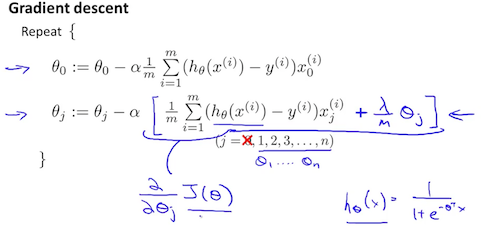

# Machine Learning Coursera - Andrew Ng

---

- [Machine Learning Coursera - Andrew Ng](#machine-learning-coursera---andrew-ng)
  - [Week #1](#week-1)
    - [Introduction](#introduction)
      - [Machine Learning](#machine-learning)
      - [Supervised Learning](#supervised-learning)
      - [Unsupervised Learning](#unsupervised-learning)
    - [Model and Cost Function](#model-and-cost-function)
      - [Model Representation](#model-representation)
      - [Cost Function](#cost-function)
      - [Cost Function - Intuition I](#cost-function---intuition-i)
      - [Cost Function - Intuition II](#cost-function---intuition-ii)
    - [Parameter Learning](#parameter-learning)
      - [Gradient Descent](#gradient-descent)
      - [Gradient Descent Intuition](#gradient-descent-intuition)
      - [Gradient Descent For Linear Regression](#gradient-descent-for-linear-regression)
    - [Linear Algebra Review](#linear-algebra-review)
      - [Matrices and Vectors](#matrices-and-vectors)
      - [Addition and Scalar Multiplication](#addition-and-scalar-multiplication)
      - [Matrix Vector Multiplication](#matrix-vector-multiplication)
      - [Matrix Matrix Multiplication](#matrix-matrix-multiplication)
      - [Matrix Multiplication Properties](#matrix-multiplication-properties)
      - [Inverse and Transpose](#inverse-and-transpose)
  - [Week #2](#week-2)
    - [Multivariate Linear Regression](#multivariate-linear-regression)
      - [Multiple Features](#multiple-features)
      - [Gradient Descent for Multiple Variables](#gradient-descent-for-multiple-variables)
      - [Gradient Descent in Practice I - Feature Scaling](#gradient-descent-in-practice-i---feature-scaling)
      - [Gradient Descent in Practice II - Learning Rate](#gradient-descent-in-practice-ii---learning-rate)
      - [Features and Polynomial Regression](#features-and-polynomial-regression)
        - [Polynomial Regression](#polynomial-regression)
    - [Computing Parameters Analytically](#computing-parameters-analytically)
      - [Normal Equation](#normal-equation)
      - [Normal Equation Noninvertibility](#normal-equation-noninvertibility)
  - [Week #3](#week-3)
    - [Classification and Representation](#classification-and-representation)
      - [Classification](#classification)
      - [Hypothesis Representation](#hypothesis-representation)
      - [Decision Boundary](#decision-boundary)
    - [Logistic Regression Model](#logistic-regression-model)
      - [Cost Function](#cost-function-1)
      - [Simplified Cost Function and Gradient Descent](#simplified-cost-function-and-gradient-descent)
        - [Gradient Descent](#gradient-descent-1)
      - [Advanced Optimization](#advanced-optimization)
    - [Multiclass Classification](#multiclass-classification)
      - [Multiclass Classification: One-vs-all](#multiclass-classification-one-vs-all)
    - [Solving the Problem of Overfitting](#solving-the-problem-of-overfitting)
      - [The Problem of Overfitting](#the-problem-of-overfitting)
      - [Cost Function](#cost-function-2)
      - [Regularized Linear Regression](#regularized-linear-regression)
        - [Gradient Descent](#gradient-descent-2)
        - [Normal Equation](#normal-equation-1)
      - [Regularized Logistic Regression](#regularized-logistic-regression)
        - [Cost Function](#cost-function-3)
  - [Week #4](#week-4)
    - [Motivations](#motivations)
      - [Non-linear Hypotheses](#non-linear-hypotheses)
      - [Neurons and the Brain](#neurons-and-the-brain)
    - [Neural Networks](#neural-networks)
      - [Model Representation I](#model-representation-i)
      - [Model Representation II](#model-representation-ii)
    - [Applications](#applications)
      - [Examples and Intuitions I](#examples-and-intuitions-i)
      - [Examples and Intuitions II](#examples-and-intuitions-ii)
      - [Multiclass Classification](#multiclass-classification-1)
  - [Week #5](#week-5)
    - [Cost Function and Backpropagation](#cost-function-and-backpropagation)
      - [Cost Function](#cost-function-4)
      - [Backpropagation Algorithm](#backpropagation-algorithm)
      - [Backpropagation Intuition](#backpropagation-intuition)
    - [Backpropagation in Practice](#backpropagation-in-practice)
      - [Implementation Note: Unrolling Parameters](#implementation-note-unrolling-parameters)
      - [Gradient Checking](#gradient-checking)
      - [Random Initialization](#random-initialization)
      - [Putting It Together](#putting-it-together)
    - [Application of Neural Networks](#application-of-neural-networks)
      - [Autonomous Driving](#autonomous-driving)
  - [Week #6](#week-6)
    - [Evaluating a Learning Algorithm](#evaluating-a-learning-algorithm)
      - [Deciding What to Try Next](#deciding-what-to-try-next)
      - [Evaluating a Hypothesis](#evaluating-a-hypothesis)
        - [The test set error](#the-test-set-error)
      - [Model Selection and Train/Validation/Test Sets](#model-selection-and-trainvalidationtest-sets)
    - [Bias vs. Variance](#bias-vs-variance)
      - [Diagnosing Bias vs. Variance](#diagnosing-bias-vs-variance)
      - [Regularization and Bias/Variance](#regularization-and-biasvariance)
      - [Learning Curves](#learning-curves)
      - [Deciding What to Do Next Revisited](#deciding-what-to-do-next-revisited)
        - [Diagnosing Neural Networks](#diagnosing-neural-networks)
    - [Building a Spam Classifier](#building-a-spam-classifier)
      - [Prioritizing What to Work On](#prioritizing-what-to-work-on)
      - [Error Analysis](#error-analysis)
    - [Handling Skewed Data](#handling-skewed-data)
      - [Error Metrics for Skewed Classes](#error-metrics-for-skewed-classes)
      - [Trading Off Precision and Recall](#trading-off-precision-and-recall)
    - [Using Large Data Sets](#using-large-data-sets)
      - [Data For Machine Learning](#data-for-machine-learning)
  - [Week #7](#week-7)
    - [Large Margin Classification](#large-margin-classification)
      - [Optimization Objective](#optimization-objective)
      - [Large Margin Intuition](#large-margin-intuition)
      - [Mathematics Behind Large Margin Classification](#mathematics-behind-large-margin-classification)
    - [Kernels](#kernels)
      - [Kernels I](#kernels-i)
      - [Kernels II](#kernels-ii)
    - [SVMs in Practice](#svms-in-practice)
      - [Using An SVM](#using-an-svm)
  - [Week #8](#week-8)
    - [Clustering](#clustering)
      - [Unsupervised Learning: Introduction](#unsupervised-learning-introduction)
      - [K-Means Algorithm](#k-means-algorithm)
      - [Optimization Objective](#optimization-objective-1)
      - [Random Initialization](#random-initialization-1)
      - [Choosing the Number of Clusters](#choosing-the-number-of-clusters)
      - [Bonus: Discussion of the drawbacks of K-Means](#bonus-discussion-of-the-drawbacks-of-k-means)
    - [Motivation](#motivation)
      - [Motivation I: Data Compression](#motivation-i-data-compression)
      - [Motivation II: Visualization](#motivation-ii-visualization)
    - [Principal Component Analysis](#principal-component-analysis)
      - [Principal Component Analysis Problem Formulation](#principal-component-analysis-problem-formulation)
      - [Principal Component Analysis Algorithm](#principal-component-analysis-algorithm)
    - [Applying PCA](#applying-pca)
      - [Reconstruction from Compressed Representation](#reconstruction-from-compressed-representation)
      - [Choosing the Number of Principal Components](#choosing-the-number-of-principal-components)
      - [Advice for Applying PCA](#advice-for-applying-pca)
  - [Week #9](#week-9)
    - [Density Estimation](#density-estimation)
      - [Problem Motivation](#problem-motivation)
      - [Gaussian Distribution](#gaussian-distribution)
      - [Algorithm](#algorithm)
    - [Building an Anomaly Detection System](#building-an-anomaly-detection-system)
      - [Developing and Evaluating an Anomaly Detection System](#developing-and-evaluating-an-anomaly-detection-system)
      - [Anomaly Detection vs. Supervised Learning](#anomaly-detection-vs-supervised-learning)
      - [Choosing What Features to Use](#choosing-what-features-to-use)
    - [Multivariate Gaussian Distribution (Optional)](#multivariate-gaussian-distribution-optional)
      - [Multivariate Gaussian Distribution](#multivariate-gaussian-distribution)
      - [Anomaly Detection using the Multivariate Gaussian Distribution](#anomaly-detection-using-the-multivariate-gaussian-distribution)
    - [Predicting Movie Ratings](#predicting-movie-ratings)
      - [Problem Formulation](#problem-formulation)
      - [Content Based Recommendations](#content-based-recommendations)
    - [Collaborative Filtering Algorithm](#collaborative-filtering-algorithm)
      - [Collaborative Filtering](#collaborative-filtering)
      - [Collaborative Filtering Algorithm](#collaborative-filtering-algorithm-1)
    - [Low Rank Matrix Factorization](#low-rank-matrix-factorization)
      - [Vectorization: Low Rank Matrix Factorization](#vectorization-low-rank-matrix-factorization)
      - [Implementational Detail: Mean Normalization](#implementational-detail-mean-normalization)
  - [Week #10](#week-10)
    - [Gradient Descent with Large Datasets](#gradient-descent-with-large-datasets)
      - [Learning with Large Datasets](#learning-with-large-datasets)
      - [Stochastic Gradient Descent](#stochastic-gradient-descent)
      - [Mini-Batch Gradient Descent](#mini-batch-gradient-descent)
      - [Stochastic Gradient Descent Convergence](#stochastic-gradient-descent-convergence)
    - [Advanced Topics](#advanced-topics)
      - [Online Learning](#online-learning)
      - [Map Reduce and Data Parallelism](#map-reduce-and-data-parallelism)

## Week #1

---

### Introduction

#### Machine Learning

Two definitions of Machine Learning are offered. Arthur Samuel described it as: "the field of study that gives computers the ability to learn without being explicitly programmed." This is an older, informal definition.

Tom Mitchell provides a more modern definition: "A computer program is said to learn from experience E with respect to some class of tasks T and performance measure P, if its performance at tasks in T, as measured by P, improves with experience E."

In general, any machine learning problem can be assigned to one of two broad classifications:

- Supervised learning
- Unsupervised learning

#### Supervised Learning

In supervised learning, we are given a data set and already know what our correct output should look like, having the idea that there is a relationship between the input and the output.

Supervised learning problems are categorized into "regression" and "classification" problems.

- Regression problem - In a regression problem, we are trying to predict results within a continuous output, meaning that we are trying to map input variables to some continuous function.
- Classigifcation problem - In a classification problem, we are instead trying to predict results in a discrete output. In other words, we are trying to map input variables into discrete categories.

#### Unsupervised Learning

Unsupervised learning allows us to approach problems with little or no idea what our results should look like. We can derive structure from data where we don't necessarily know the effect of the variables.

We can derive this structure by clustering the data based on relationships among the variables in the data.

With unsupervised learning there is no feedback based on the prediction results.

### Model and Cost Function

#### Model Representation

- $m$ - number of training examples
- $x$ - "input" variable / features
- $y$ - "output" variable / "target" variable
- $X$ - space of input values
- $Y$ - space of output values
- $(x,y)$ - one training example
- $(x^{(i)}, y^{(i)})$ - $i^{th}$ training example

A list of training examples is called a **training set**.

The way the supervised learning algorithm works is by feeding the trainign set to the learning algorithm. The job of the learning algorithm is to output a function which by convention is denoted by $h$ and $h$ stands for **hypothesis**. The job of the hypothesis is a function that takes input and tries to output the estimated value for the corresponding input. $h$ is a function that maps x to y.


To describe the supervised learning problem slightly more formally, our goal is, given a training set, to learn a function $h : X \to Y$ so that $h(x)$ is a “good” predictor for the corresponding value of y.

The way to represent $h$ is by:

$$ h_{\theta} (x) = \theta_{0} + \theta_{1}x$$

Shorthand: $h(x)$ is equivalent to $h_{\theta}x$

This way, the model will predict that y is a linear function of x. It is called **linear regression**, or actually **linear regression with one variable**, or **univariate linear regression**.

#### Cost Function

$\theta_{0}$ and $\theta_{1}$ are called the parameters of this model.

In linear regression, we want to come up with values for the parameters such that the line best fits to the data given.

Idea: Choose $\theta_{0}$ and $\theta_{1}$, so that $h_{\theta} (x)$ is close to $y$ for our training examples $(x,y)$

Therefore, a minimization problem has to be solved.

Minimize over $\theta_{0}$ and $\theta_{1}$ the sum of the square differences between the predicted value and the real output for each training example.

$$ \text{Minimize over } \theta_{0},\theta_{1}: \hskip{0.1em} \frac{1}{2m} \sum_{i = 1}^{m} (h_{\theta}(x^{(i)}) - y^{(i)})^{2} $$

$$ h_{\theta}(x^{(i)}) = \theta_{0} + \theta_{1} x^{i} $$

Note: Minimizing one half of something should give the same result as minimizing the whole.

Therefore, the idea is to find the values of $\theta_{0}$ and $\theta_{1}$ that cause the above expression to be minimized.

The cost function is:

$$ J(\theta_{0}, \theta_{1}) = \frac{1}{2m} \sum_{i = 1}^{m} (h_{\theta}(x^{(i)}) - y^{(i)})^{2} $$

$$ \text{Minimize over } \theta_{0},\theta_{1} \hskip{0.1em} J(\theta_{0}, \theta_{1}) $$

This cost function is also called the **squared error function** or sometimes called the **squared error cost function** or **mean squared error**.

The squared cost function is probably the most commonly used one as it works well in most cases.

We can measure the accuracy of our hypothesis function by using a **cost function**.

$$ J(\theta_{0}, \theta_{1}) = \frac{1}{2m} \sum_{i = 1}^{m} (\hat{y}^{(i)} - y^{(i)})^{2} $$

The mean is halved as a convenience for the computation of the gradient descent, as the derivative term of the square function will cancel out the $\frac{1}{2}$ term.


#### Cost Function - Intuition I

Working on a simplified hypothesis dependent only one parameter with the same cost function and minimizing only on one parameter $\theta_{1})$:

$$ h_{\theta} (x) = \theta_{1}x $$

Therefore, the fit line will pass through the origin and only depend on the slope, ($\theta_{1}$) parameter.

If we try to think of it in visual terms, our training data set is scattered on the $x-y$ plane. We are trying to make a straight line (defined by $h_{\theta} (x)$) which passes through these scattered data points.

Our objective is to get the best possible line. The best possible line will be such so that the average squared vertical distances of the scattered points from the line will be the least. Ideally, the line should pass through all the points of our training data set. In such a case, the value of $J(\theta_{0}, \theta_{1})$ will be 0. The following example shows the ideal situation where we have a cost function of 0.


When $\theta_{1} = 1$, we get a slope of 1 which goes through every single data point in our model. Conversely, when $\theta_{1} = 0.5$, we see the vertical distance from our fit to the data points increase.


This increases our cost function to 0.58. Plotting several other points yields the following graph:


Thus as a goal, we should try to minimize the cost function. In this case, $\theta_{1} = 1$ is our global minimum.

#### Cost Function - Intuition II

Trying to fit a line with 2 parameters now instead of only one as in the example above would yield a cost function $J$, similar to a 2-1 map.

Therefore, for different choices of the 2 parameters, the cost function will yield different results.

A contour plot is a graph that contains many contour lines. A contour line of a two variable function has a constant value at all points of the same line. An example of such a graph is the one to the right below.


Taking any color and going along the 'circle', one would expect to get the same value of the cost function. For example, the three green points found on the green line above have the same value for $J(\theta_{0},\theta_{1})$ and as a result, they are found along the same line. The circled $x$ displays the value of the cost function for the graph on the left when $\theta_{0} = 800$ and $\theta_{1} = -0.15$. Taking another $h(x)$ and plotting its contour plot, one gets the following graphs:


When $\theta_{0} = 360$ and $\theta_{1} = 0$, the value of $J(\theta_{0},\theta_{1})$ in the contour plot gets closer to the center thus reducing the cost function error. Now giving our hypothesis function a slightly positive slope results in a better fit of the data.


The graph above minimizes the cost function as much as possible and consequently, the result of $\theta_{1}$ and $\theta_{0}$ tend to be around $0.12$ and $250$ respectively. Plotting those values on our graph to the right seems to put our point in the center of the inner most 'circle'.

### Parameter Learning

#### Gradient Descent

Gradient Descent is the algorithm used to find the minimum of the cost function that we previously talked about, but not only.

So we have our hypothesis function and we have a way of measuring how well it fits into the data. Now we need to estimate the parameters in the hypothesis function. That's where gradient descent comes in.

Imagine that we graph our hypothesis function based on its fields $\theta_{0}$ and $\theta_{1}$ (actually we are graphing the cost function as a function of the parameter estimates). We are not graphing $x$ and $y$ itself, but the parameter range of our hypothesis function and the cost resulting from selecting a particular set of parameters.

We put $\theta_{0}$ on the $x$ axis and $\theta_{1}$ on the $y$ axis, with the cost function on the vertical $z$ axis. The points on our graph will be the result of the cost function using our hypothesis with those specific theta parameters. The graph below depicts such a setup.


We will know that we have succeeded when our cost function is at the very bottom of the pits in our graph, i.e. when its value is the minimum. The red arrows show the minimum points in the graph.

The way we do this is by taking the derivative (the tangential line to a function) of our cost function. The slope of the tangent is the derivative at that point and it will give us a direction to move towards. We make steps down the cost function in the direction with the steepest descent. The size of each step is determined by the parameter $\alpha$, which is called the learning rate.

For example, the distance between each 'star' in the graph above represents a step determined by our parameter $\alpha$. A smaller $\alpha$ would result in a smaller step and a larger $\alpha$ results in a larger step. The direction in which the step is taken is determined by the partial derivative of $J(\theta_{0}, \theta_{1})$. Depending on where one starts on the graph, one could end up at different points. The image above shows us two different starting points that end up in two different places.

Gradient Descent Algorithm is defined as:

Repeat until convergence: {
    $$ \theta_{j} := \theta_{j} - \alpha \frac{\partial}{\partial\theta_{j}} J(\theta_{0}, \theta_{1}) \hskip{0.2em} (\text{for } j = 0 \text{ and } j = 1) $$
}

Parts:

- $\alpha$ - learning rate (how big of a step we take descending)
- $\frac{\partial}{\partial\theta_{j}} J(\theta_{0}, \theta_{1})$ - derivative term

Both partials are simultaneously updated,  meaning that the updated values for each parameter are updated in such a way that they did not interfere with the respective calculations of the other.

temp0 $:= \theta_{j} := \theta_{0} - \alpha \frac{\partial}{\partial\theta_{0}} J(\theta_{0}, \theta_{1}) $

temp1 $:= \theta_{j} := \theta_{1} - \alpha \frac{\partial}{\partial\theta_{1}} J(\theta_{0}, \theta_{1}) $

$\theta_{0} :=$ temp0

$\theta_{1} :=$ temp1


At each iteration $j$, one should simultaneously update the parameters $\theta_{1}, \theta_{2}, \dots, \theta_{n}$. Updating a specific parameter prior to calculating another one on the $j^{(th)}$ iteration would yield to a wrong implementation.

#### Gradient Descent Intuition

Regardless of the slope's sign for $\frac{d}{d\theta_{1}}$, $\theta_{1}$ eventually converges to its minimum value. The following graph shows that when the slope is negative, the value of $\theta_{1}$ increases and when it is positive, the value of $\theta_{1}$ decreases.


On a side note, we should adjust our parameter $\alpha$ to ensure that the gradient descent algorithm converges in a reasonable time. Failure to converge or too much time to obtain the minimum value imply that our step size is wrong.


How does gradient descent converge with a fixed step size $\alpha$?

The intuition behind the convergence is that $\frac{d}{d\theta_{1}}$ approaches 0 as we approach the bottom of our convex function. At the minimum, the derivative will always be 0 and thus we get:

$$ \theta_{1} = \theta_{1} - \alpha \cdot 0 $$


#### Gradient Descent For Linear Regression

When specifically applied to the case of linear regression, a new form of the gradient descent equation can be derived. We can substitute our actual cost function and our actual hypothesis function and modify the equation to:

repeat until convergence: {
    $$ \theta_{0} := \theta_{0} - \alpha \frac{1}{m} \sum_{i = 1}^{m} (h_{\theta}(x_{i}) - y_{i}) $$
    $$ \theta_{1} := \theta_{1} - \alpha \frac{1}{m} \sum_{i = 1}^{m} ((h_{\theta}(x_{i}) - y_{i})x_{i}) $$
}

where $m$ is the size of the training set, $\theta_{0}$ a constant that will be changing simultaneously with $\theta_{1}$ and $x_{i}$, $y_{i}$ are values of the given training set (data).

Note that we have separated out the two cases for $\theta_{j}$ into separate equations for $\theta_{0}$ and $\theta_{1}$; and that for $\theta_{1}$ we are multiplying $x_{i}$ at the end due to the derivative. The following is a derivation of $\frac{\partial}{\partial \theta_{j}} J(\theta)$ for a single example:


The point of all this is that if we start with a guess for our hypothesis and then repeatedly apply these gradient descent equations, our hypothesis will become more and more accurate.

So, this is simply gradient descent on the original cost function $J$. This method looks at every example in the entire training set on every step, and is called **batch gradient descent**. Note that, while gradient descent can be susceptible to local minima in general, the optimization problem we have posed here for linear regression has only one global, and no other local, optima; thus gradient descent always converges (assuming the learning rate $\alpha$ is not too large) to the global minimum. Indeed, $J$ is a convex quadratic function. Here is an example of gradient descent as it is run to minimize a quadratic function.


The ellipses shown above are the contours of a quadratic function. Also shown is the trajectory taken by gradient descent, which was initialized at $(48,30)$. The $x$’s in the figure (joined by straight lines) mark the successive values of $\theta$ that gradient descent went through as it converged to its minimum.

### Linear Algebra Review

#### Matrices and Vectors

Matrices are 2-dimensional arrays:

$$
\begin{bmatrix}
a & b & cd & e & fg & h & ij & k & l
\end{bmatrix}
$$

The above matrix has four rows and three columns, so it is a $4 \times 3$ matrix.

A vector is a matrix with one column and many rows:

$$
\begin{bmatrix}
w \\
x \\
y \\
z
\end{bmatrix}
$$

So vectors are a subset of matrices. The above vector is a $4 \times 1$ matrix.

**Notation and terms:**

- $A_{ij}$ refers to the element in the $i^{th}$ row and $j^{th}$ column of matrix $A$.
- A vector with '$n$' rows is referred to as an '$n$'-dimensional vector.
- $v_{i}$ refers to the element in the $i^{th}$ row of the vector.
- In general, all our vectors and matrices will be 1-indexed. Note that for some programming languages, the arrays are 0-indexed.
- Matrices are usually denoted by uppercase names while vectors are lowercase.
- "Scalar" means that an object is a single value, not a vector or matrix.
- $\mathbb{R}$ refers to the set of scalar real numbers.
- $\mathbb{R}^{n}$ refers to the set of $n$-dimensional vectors of real numbers.

Octave/Matlab Code:

```matlab
% The ; denotes we are going back to a new row.
A = [1, 2, 3; 4, 5, 6; 7, 8, 9; 10, 11, 12]

% Initialize a vector
v = [1;2;3]

% Get the dimension of the matrix A where m = rows and n = columns
[m,n] = size(A)

% You could also store it this way
dim_A = size(A)

% Get the dimension of the vector v
dim_v = size(v)

% Now let's index into the 2nd row 3rd column of matrix A
A_23 = A(2,3)
```

#### Addition and Scalar Multiplication

Addition and subtraction are **element-wise**, so you simply add or subtract each corresponding element:

$
\begin{bmatrix}
a & bc & d
\end{bmatrix}
$ + $
\begin{bmatrix}
w & xy & z
\end{bmatrix}
$ = $
\begin{bmatrix}
a + w & bc + xy & d + z
\end{bmatrix}
$

Subtracting Matrices:

$
\begin{bmatrix}
a & bc & d
\end{bmatrix}
$ - $
\begin{bmatrix}
w & xy & z
\end{bmatrix}
$ = $
\begin{bmatrix}
a - w & bc - xy & d - z
\end{bmatrix}
$

To add or subtract two matrices, their dimensions must be **the same**.

In scalar multiplication, we simply multiply every element by the scalar value:

$
\begin{bmatrix}
a & bc & d
\end{bmatrix}
$ * $
x
$ = $
\begin{bmatrix}
a * x & bc * x & d * x
\end{bmatrix}
$

In scalar division, we simply divide every element by the scalar value:

$
\begin{bmatrix}
a & bc & d
\end{bmatrix}
$ / $
x
$ = $
\begin{bmatrix}
a / x & bc / x & d / x
\end{bmatrix}
$

Octave/Matlab Code:

```matlab
% Initialize matrix A and B
A = [1, 2, 4; 5, 3, 2]
B = [1, 3, 4; 1, 1, 1]

% Initialize constant s
s = 2

% See how element-wise addition works
add_AB = A + B

% See how element-wise subtraction works
sub_AB = A - B

% See how scalar multiplication works
mult_As = A * s

% Divide A by s
div_As = A / s

% What happens if we have a Matrix + scalar?
add_As = A + s
```

#### Matrix Vector Multiplication

We map the column of the vector onto each row of the matrix, multiplying each element and summing the result.

$
\begin{bmatrix}
a & b\\
c & d\\
e & f
\end{bmatrix}
$ * $
\begin{bmatrix}
x \\
y
\end{bmatrix}
$ = $
\begin{bmatrix}
a * x + b * y\\
c * x + d * y\\
e * x + f * y
\end{bmatrix}
$

The result is a **vector**. The number of **columns** of the matrix must equal the number of **rows** of the vector.

An **m $\boldsymbol\times$ n** matrix multiplied by an **n $\boldsymbol\times$ 1** vector results in an **m $\boldsymbol\times$ 1** vector.

Octave/Matlab Code:

```matlab
% Initialize matrix A
A = [1, 2, 3; 4, 5, 6;7, 8, 9]

% Initialize vector v
v = [1; 1; 1]

% Multiply A * v
Av = A * v
```

#### Matrix Matrix Multiplication

We multiply two matrices by breaking it into several vector multiplications and concatenating the result.

$
\begin{bmatrix}
a & b\\
c & d\\
e & f
\end{bmatrix}
$ * $
\begin{bmatrix}
w & x\\
y & z
\end{bmatrix}
$ = $
\begin{bmatrix}
a * w + b * y & a * x + b * z\\
c * w + d * y & c * x + d * z\\
e * w + f * y & e * x + f * z
\end{bmatrix}
$

An **m $\boldsymbol\times$ n** matrix multiplied by an **n $\boldsymbol\times$ o** matrix results in an **m $\boldsymbol\times$ o** matrix. In the above example, a 3 $\times$ 2 matrix times a 2 $\times$ 2 matrix resulted in a 3 $\times$ 2 matrix.

To multiply two matrices, the number of **columns** of the first matrix must equal the number of **rows** of the second matrix.

Octave/Matlab Code:

```matlab
% Initialize a 3 by 2 matrix
A = [1, 2; 3, 4;5, 6]

% Initialize a 2 by 1 matrix
B = [1; 2]

% We expect a resulting matrix of (3 by 2)*(2 by 1) = (3 by 1)
mult_AB = A*B

% Make sure you understand why we got that result
```

#### Matrix Multiplication Properties

- Matrices are not commutative: $A * B \neq B * A$
- Matrices are associative: $(A * B) * C = A * (B * C)$

The **identity matrix**, when multiplied by any matrix of the same dimensions, results in the original matrix. It's just like multiplying numbers by 1. The identity matrix simply has 1's on the diagonal (upper left to lower right diagonal) and 0's elsewhere.

$$
\begin{bmatrix}
1 & 0 & 0\\
0 & 1 & 0\\
0 & 0 & 1
\end{bmatrix}
$$

When multiplying the identity matrix after some matrix (A∗I), the square identity matrix's dimension should match the other matrix's **columns**. When multiplying the identity matrix before some other matrix $(I*A)$, the square identity matrix's dimension should match the other matrix's **rows**.

Octave/Matlab Code:

```matlab
% Initialize random matrices A and B
A = [1,2;4,5]
B = [1,1;0,2]

% Initialize a 2 by 2 identity matrix
I = eye(2)

% The above notation is the same as I = [1,0;0,1]

% What happens when we multiply I*A ?
IA = I*A

% How about A*I ?
AI = A*I

% Compute A*B
AB = A*

% Is it equal to B*A?
BA = B*

% Note that IA = AI but AB != B
```

#### Inverse and Transpose

The **inverse** of a matrix $A$ is denoted $A^{-1}$. Multiplying by the inverse results in the identity matrix.

A non square matrix does not have an inverse matrix. We can compute inverses of matrices in Octave with the $pinv(A)$ function and in Matlab with the $inv(A)$ function. Matrices that don't have an inverse are *singular* or *degenerate*.

The **transposition** of a matrix is like rotating the matrix 90° in clockwise direction and then reversing it. We can compute transposition of matrices in Matlab with the $transpose(A)$ function or $A'$:

$$
A =
\begin{bmatrix}
a & b\\
c & d\\
e & f
\end{bmatrix}
$$

$$
A^{T} =
\begin{bmatrix}
a & c & e\\
b & d & f
\end{bmatrix}
$$

In other words:

$A_{ij} = A_{ji}^{T}$

Octave/Matlab Code:

```matlab
% Initialize matrix A
A = [1,2,0;0,5,6;7,0,9]

% Transpose A
A_trans = A'

% Take the inverse of A
A_inv = inv(A)

% What is A^(-1)*A?
A_invA = inv(A)*A
```

## Week #2

---

### Multivariate Linear Regression

#### Multiple Features

Linear regression with multiple variables is also known as **multivariate linear regression**.

We now introduce notation for equations where we can have any number of input variables.

- $x_{j}^{(i)}$ = value of feature $j$ in the $i^{th}$ training example
- $x^{(i)}$ = the input (features) of the $i^{th}$ training example
- $m$ = the number of training examples
- $n$ = the number of features

The multivariable form of the hypothesis function accommodating these multiple features is as follows:

$$ h_{\theta} (x) = \theta_{0} + \theta_{1}x_{1} + \theta_{2}x_{2} + \theta_{3}x_{3} + \dots + \theta_{n}x_{n} $$

In order to develop intuition about this function, we can think about $\theta_{0}$ as the basic price of a house, $\theta_{1}$ as the price per square meter, $\theta_{2}$ as the price per floor, etc. $x_{1}$ will be the number of square meters in the house, $x_{2}$ the number of floors, etc.

Using the definition of matrix multiplication, our multivariable hypothesis function can be concisely represented as:

$
h_{\theta} (x) =
\begin{bmatrix}
\theta_{0} & \theta_{1} & \cdots & \theta_{n}
\end{bmatrix}
$$
\begin{bmatrix}
x_{0}\\
x_{1}\\
\vdots\\
x_{n}
\end{bmatrix}
$ = $
\theta^{T}x
$

This is a vectorization of our hypothesis function for one training example; see the lessons on vectorization to learn more.

**Remark**: Note that for convenience reasons in this course we assume $x_{0}^{(i)} = 1 \text{ for } (i\in { 1,\dots, m })$. This allows us to do matrix operations with $\theta$ and $x$. Hence making the two vectors '$\theta$' and $x^{(i)}$ match each other element-wise (that is, have the same number of elements: $n+1$).

#### Gradient Descent for Multiple Variables

The gradient descent equation itself is generally the same form; we just have to repeat it for our $n$ features:

repeat until convergence: {
    $$ \theta_{0} := \theta_{0} - \alpha \frac{1}{m} \sum_{i = 1}^{m} (h_{\theta}(x^{(i)}) - y^{(i)}) \cdot x_{0}^{(i)} $$
    $$ \theta_{1} := \theta_{1} - \alpha \frac{1}{m} \sum_{i = 1}^{m} (h_{\theta}(x^{(i)}) - y^{(i)}) \cdot x_{1}^{(i)} $$
    $$ \theta_{2} := \theta_{2} - \alpha \frac{1}{m} \sum_{i = 1}^{m} (h_{\theta}(x^{(i)}) - y^{(i)}) \cdot x_{2}^{(i)} $$
    $$\vdots$$
}

In other words:

repeat until convergence: {
    $$ \theta_{j} := \theta_{j} - \alpha \frac{1}{m} \sum_{i = 1}^{m} (h_{\theta}(x^{(i)}) - y^{(i)}) \cdot x_{j}^{(i)} \hskip{0.2em} \text{for } j := 0, \dots, n $$
}

The following image compares gradient descent with one variable to gradient descent with multiple variables:


#### Gradient Descent in Practice I - Feature Scaling

We can speed up gradient descent by having each of our input values in roughly the same range. This is because $\theta$ will descend quickly on small ranges and slowly on large ranges, and so will oscillate inefficiently down to the optimum when the variables are very uneven.

The way to prevent this is to modify the ranges of our input variables so that they are all roughly the same. Ideally:

$$ -1 \leq x_{(i)} \leq 1 $$

or

$$ -0.5 \leq x_{(i)} \leq 0.5 $$

These aren't exact requirements; we are only trying to speed things up. The goal is to get all input variables into roughly one of these ranges, give or take a few.

Two techniques to help with this are **feature scaling** and **mean normalization**. Feature scaling involves dividing the input values by the range (i.e. the maximum value minus the minimum value) of the input variable, resulting in a new range of just $1$. Mean normalization involves subtracting the average value for an input variable from the values for that input variable resulting in a new average value for the input variable of just zero. To implement both of these techniques, adjust your input values as shown in this formula:

$$ x_{i} := \frac{x_{i} - \mu_{i}}{s_{i}} $$

Where $\mu_{i}$ is the **average** of all the values for feature ($i$) and $s_{i}$ is the range of values (max - min), or $s_{i}$ is the standard deviation.

Note that dividing by the range, or dividing by the standard deviation, give different results. The quizzes in this course use range - the programming exercises use standard deviation.

For example, if $x_{i}$ represents housing prices with a range of 100 to 2000 and a mean value of 1000, then, $x_{i} := \frac{price - 1000}{1900}$.

#### Gradient Descent in Practice II - Learning Rate

**Debugging gradient descent.** Make a plot with number of iterations on the $x$-axis. Now plot the cost function, $J(\theta)$ over the number of iterations of gradient descent. If $J(\theta)$ ever increases, then you probably need to decrease $\alpha$.

**Automatic convergence test.** Declare convergence if $J(\theta)$ decreases by less than $E$ in one iteration, where $E$ is some small value such as $10^{-3}$. However in practice it's difficult to choose this threshold value.


It has been proven that if learning rate $\alpha$ is sufficiently small, then $J(\theta)$ will decrease on every iteration.


To summarize:

- If $\alpha$ is too small: slow convergence.
- If $\alpha$ is too large: $J(\theta)$ may not decrease on every iteration and thus may not converge.

#### Features and Polynomial Regression

We can improve our features and the form of our hypothesis function in a couple different ways.

We can combine multiple features into one. For example, we can combine $x_{1}$ and $x_{2}$ into a new feature $x_{3}$ by taking $x_{1} \cdot x_{2}$.

##### Polynomial Regression

Our hypothesis function need not be linear (a straight line) if that does not fit the data well.

We can **change the behavior or curve** of our hypothesis function by making it a quadratic, cubic or square root function (or any other form).

For example, if our hypothesis function is $h_{\theta} (x) = \theta_{0} + \theta_{1}x_{1}$ then we can create additional features based on $x_{1}$, to get the quadratic function $h_{\theta} (x) = \theta_{0} + \theta_{1}x_{1} + \theta_{2}x_{1}^{2}$ or the cubic function $h_{\theta} (x) = \theta_{0} + \theta_{1}x_{1} + \theta_{2}x_{1}^{2} + \theta_{3}x_{1}^{3}$

In the cubic version, we have created new features $x_{2}$ and $x_{3}$ where $x_{2} = x_{1}^{2}$ and $x_{3} = x_{1}^{3}$.

To make it a square root function, we could do: $h_{\theta} (x) = \theta_{0} + \theta_{1}x_{1} + \theta_{2}\sqrt{x_{1}}$

One important thing to keep in mind is, if you choose your features this way then feature scaling becomes very important.

eg. if $x_{1}$ has range $1 - 1000$ then range of $x_{1}^{2}$ becomes $1 - 100000$ and that of $x_{1}^{3}$ becomes $1 - 10^{9}$.

### Computing Parameters Analytically

#### Normal Equation

Gradient descent gives one way of minimizing $J$. Let’s discuss a second way of doing so, this time performing the minimization explicitly and without resorting to an iterative algorithm. In the "Normal Equation" method, we will minimize $J$ by explicitly taking its derivatives with respect to the $\theta_{j}$’s, and setting them to zero. This allows us to find the optimum $\theta$ without iteration. The normal equation formula is given below:

$$ \theta = (X^{T}X)^{-1}X^{T}y $$


There is **no need** to do feature scaling with the normal equation.

The following is a comparison of gradient descent and the normal equation:

| Gradient Descent              | Normal Equation                               |
|-------------------------------|-----------------------------------------------|
| Need to choose $\alpha$       | No need to choose $\alpha$                    |
| Needs many iterations         | No need to iterate                            |
| $O(kn^{2})$                   | $O(n^{3})$, need to calculate $(X^{T}X)^{-1}$ |
| Works well when $n$ is large  | Slow if $n$ is very large                     |

With the normal equation, computing the inversion has complexity $O(n^{3})$. So if we have a very large number of features, the normal equation will be slow. In practice, when $n$ exceeds $10,000$ it might be a good time to go from a normal solution to an iterative process.

#### Normal Equation Noninvertibility

When implementing the normal equation in Octave we want to use the '$pinv$' function rather than '$inv$.' The '$pinv$' function will give you a value of $\theta$ even if $X^{T}X$ is not invertible.

If $X^{T}X$ is **noninvertible**, the common causes might be having:

- Redundant features, where two features are very closely related (i.e. they are linearly dependent)
- Too many features (e.g. $m \leq n$). In this case, delete some features or use "regularization" (to be explained in a later lesson).

Solutions to the above problems include deleting a feature that is linearly dependent with another or deleting one or more features when there are too many features.

## Week #3

---

### Classification and Representation

#### Classification

To attempt classification, one method is to use linear regression and map all predictions greater than $0.5$ as a $1$ and all less than $0.5$ as a $0$. However, this method doesn't work well because classification is not actually a linear function.

The classification problem is just like the regression problem, except that the values we now want to predict take on only a small number of discrete values. For now, we will focus on the **binary classification problem** in which $y$ can take on only two values, $0$ and $1$. (Most of what we say here will also generalize to the multiple-class case.) For instance, if we are trying to build a spam classifier for email, then $x^{(i)}$ may be some features of a piece of email, and $y$ may be $1$ if it is a piece of spam mail, and $0$ otherwise. Hence, $y \in \{0, 1\}$. $0$ is also called the negative class, and $1$ the positive class, and they are sometimes also denoted by the symbols "-" and "+". Given $x^{(i)}$, the corresponding $y^{(i)}$ is also called the label for the training example.

#### Hypothesis Representation

We could approach the classification problem ignoring the fact that $y$ is discrete-valued, and use our old linear regression algorithm to try to predict $y$ given $x$. However, it is easy to construct examples where this method performs very poorly. Intuitively, it also doesn’t make sense for $h_{\theta} (x)$ to take values larger than $1$ or smaller than $0$ when we know that $y \in \{0, 1\}$. To fix this, let’s change the form for our hypotheses $h_{\theta} (x)$ to satisfy $0 \leq h_{\theta} (x) \leq 10$. This is accomplished by plugging $\theta^{T}x$ into the Logistic Function.

Our new form uses the "Sigmoid Function," also called the "Logistic Function":

$$ h_{\theta} (x) = g(\theta^{T} x) $$
$$ z = \theta^{T} x $$
$$ g(z) = \frac{1}{1 + e^{-z}} $$

The following image shows us what the sigmoid function looks like:


The function $g(z)$, shown here, maps any real number to the $(0, 1)$ interval, making it useful for transforming an arbitrary-valued function into a function better suited for classification.

$h_{\theta} (x)$ will give us the **probability** that our output is $1$. For example, $h_{\theta} (x) = 0.7$ gives us a probability of $70\%$ that our output is $1$. Our probability that our prediction is $0$ is just the complement of our probability that it is $1$ (e.g. if probability that it is $1$ is $70\%$, then the probability that it is $0$ is $30\%$).

$$ h_{\theta} (x) = P (y = 1 | x ; \theta) = 1 − P (y = 0 | x ; \theta) $$
$$ P (y = 0 | x ; \theta) + P (y = 1 | x ; \theta) = 1 $$

#### Decision Boundary

In order to get our discrete $0$ or $1$ classification, we can translate te output of the hypothesis function as follows:

$$ h_{\theta} (x) \geq 0.5 \to y = 1 $$
$$ h_{\theta} (x) < 0.5 \to y = 0 $$

The way our logistic function $g$ behaves is that when its input is greater than or equal to zero, its output is greater than or equalt $0.5$:

$$ g(z) \geq 0.5 \text{ when } z \geq 0 $$

Remember:

$$ z = 0, e^{0} = 1 \Rightarrow g(z) = 1/2 $$
$$ z \to \infty, e^{-\infty} \to 0 \Rightarrow g(z) = 1 $$
$$ z \to -\infty, e^{\infty} \to \infty \Rightarrow g(z) = 0 $$

So if our input to $g$ is $\theta^{T}X$, then that means:

$$ h_{\theta} (x) = g(\theta^{T}x) \geq 0.5 \text{ when } \theta^{T}x \geq 0 $$

From these statements we can now say:

$$ \theta^{T}x \geq 0 \Rightarrow y = 1 $$
$$ \theta^{T}x < 0 \Rightarrow y = 0 $$

The **decision boundary** is the line that separates the area where $y = 0$ and where $y = 1$. It is created by our hypothesis function.

**Example:**

$$ \theta = \begin{bmatrix}5\\-1\\0\end{bmatrix} $$
$$ y = 1 \text{ if } 5 + (-1)x_{1} + 0x_{2} \geq 0 $$
$$ 5 - x_{1} \geq 0 $$
$$ -x_{1} \geq -5 $$
$$ x_{1} \leq 5 $$

In this case, our decision boundary is a straight vertical line placed on the graph where $x_{1} = 5$, and everything to the left of that denotes $y = 1$, while everything to the right denotes $y = 0$.

Again, the input to the sigmoid function $g(z)$ (e.g. $\theta^{T}X$) doesn't need to be linear, and could be a function that describes a circle (e.g. $z = \theta_{0} + \theta_{1}x_{1}^{2} + \theta_{2}x_{2}^{2}$) or any shape to fit our data.

### Logistic Regression Model

#### Cost Function

We cannot use the same cost function that we use for linear regression because the Logistic Function will cause the output to be wavy, causing many local optima. In other words, it will not be a convex function.

Instead, our cost function for logistic regression looks like:

$$ J(\theta) = \frac{1}{m} \sum_{i = 1}^{m} \text{ Cost} (h_{\theta} (x^{(i)}), y^{(i)}) $$
$$ \text{Cost} (h_{\theta} (x), y) = -\log(h_{\theta} (x)) \hskip{0.2em} \text{if } y = 1 $$
$$ \text{Cost} (h_{\theta} (x), y) = -\log(1 - h_{\theta} (x)) \hskip{0.2em} \text{if } y = 0 $$

When $y = 1$, we get the following plot for $J(\theta)$ vs $h_{\theta} (x)$:


Similarly, when $y = 0$, we get the following plot for $J(\theta)$ vs $h_{\theta} (x)$:


$$ \text{Cost} (h_{\theta} (x), y) = 0 \text{ if } h_{\theta} (x) = y $$
$$ \text{Cost} (h_{\theta} (x), y) \to \infty \text{ if } y = 0 \text{ and } h_{\theta} (x) \to 1 $$
$$ \text{Cost} (h_{\theta} (x), y) \to \infty \text{ if } y = 1 \text{ and } h_{\theta} (x) \to 0 $$

If our correct answer 'y' is $0$, then the cost function will be $0$ if our hypothesis function also outputs $0$. If our hypothesis approaches $1$, then the cost function will approach infinity.

If our correct answer 'y' is $1$, then the cost function will be $0$ if our hypothesis function outputs $1$. If our hypothesis approaches $0$, then the cost function will approach infinity.

Note that writing the cost function in this way guarantess that $J(\theta)$ is convex for logistic regression.

#### Simplified Cost Function and Gradient Descent

We can compress our cost function's two conditional cases into one case:

$$ \text{Cost} (h_{\theta} (x), y) = -y \log(h_{\theta} (x)) - (1 - y) \log(1 - h_{\theta} (x)) $$

Notice that when $y$ is equl to $1$, then the second term $(1 - y) \log(1 - h_{\theta} (x))$ will be zero and will not affect the result. If $y$ is equal to $0$, then the first term $-y \log(h_{\theta} (x))$ will be zero and will not affect the result.

We can fully write out our entire cost function as follows:

$$ J(\theta) = -\frac{1}{m} \sum_{i = 1}^{m} [y^{(i)} \log(h_{\theta} (x^{(i)})) + (1 - y^{(i)}) \log(1 - h_{\theta} (x^{(i)}))] $$

A vectorized implementation is:

$$ h = g(X\theta) $$
$$ J(\theta) = \frac{1}{m} \cdot (-y^{T}\log(h) - (1 - y)^{T}\log(1 - h)) $$

##### Gradient Descent

Remember that the general form of gradient descent is:

Repeat {
    $$ \theta_{j} := \theta_{j} - \alpha \frac{\partial}{\partial\theta_{j}} J(\theta) $$
}

We can work out the derivative part using calculus to get:

Repeat {
    $$ \theta_{j} := \theta_{j} - \frac{\alpha}{m} \sum_{i = 1}^{m} (h_{\theta} (x^{(i)}) - y^{(i)}) x_{j}^{(i)} $$
}

Notice that this algorithm is indetical to the one we used in linear regression. We still have to simultaneously update all values in theta.

A vectorized implementation is:

$$ \theta := \theta - \frac{\alpha}{m} X^{T}(g(X\theta) - \vec{y}) $$

#### Advanced Optimization

"Conjugate gradient", "BFGS", and "L-BFGS" are more sophisticated, faster ways to optimize $\theta$ that can be used instead of gradient descent. We suggest that you should not write these more sophisticated algorithms yourself (unless you are an expert in numerical computing) but use the libraries instead, as they're already tested and highly optimized. Octave provides them.

We first need to provide a function that evaluates the following two functions for a given input value $\theta$:

- $J(\theta)$
- $\frac{\partial}{\partial \theta_{j}} J(\theta)$

We can write a single function that returns both of these:

```matlab
function [jVal, gradient] = costFunction(theta)
  jVal = [...code to compute J(theta)...];
  gradient = [...code to compute derivative of J(theta)...];
end
```

Then we can use Octave's "fminunc()" optimization algorithm along with the "optimset()" function that creates an object containing the options we want to send to "fminunc()".

```matlab
options = optimset('GradObj', 'on', 'MaxIter', 100);
initialTheta = zeros(2,1);
    [optTheta, functionVal, exitFlag] = fminunc(@costFunction, initialTheta, options);
```

We give to the function "fminunc()" our cost function, our initial vector of theta values, and the "options" object that we created beforehand.

### Multiclass Classification

#### Multiclass Classification: One-vs-all

Now we will approach the classification of data when we have more than two categories. Instead of $y = \{0, 1\}$ we will expand our definition so that $y = \{0, 1, \dots, n\}$.

Since $y = \{0, 1, \dots, n\}$, we divide our problem into $n + 1$ ($+1$ because our index starts at $0$) binary classification problems; in each one, we predict the probability that 'y' is a member of one of our classes.

$$ y \in \{0, 1, \dots, n\} $$
$$ h_{\theta}^{(0)} = P(y = 0 | x ; \theta) $$
$$ h_{\theta}^{(1)} = P(y = 1 | x ; \theta) $$
$$ \vdots $$
$$ h_{\theta}^{(n)} = P(y = n | x ; \theta) $$
$$ \text{prediction } = \text{ max}_{i} (h_{\theta}^{(i)} (x)) $$

We are basically choosing one class and then lumping all the others into a single second class. We do this repeatedly, applying binary logistic regression to each case, and then use the hypothesis that returned the highest value as our prediction.

The following image shows how one could classify 3 classes:


**To summarize:**

Train a logistic regression classifier $h_{\theta} (x)$ for each class to predict the probability that $y = i$.

To make a prediction on a new $x$, pick the class that maximizes $h_{\theta} (x)$.

### Solving the Problem of Overfitting

#### The Problem of Overfitting

Consider the problem of predicting $y$ from $x \in \mathbb{R}$. The leftmost figure below shows the result of fitting a $y = \theta_{0} + \theta_{1}x$ to a dataset. We see that the data doesn’t really lie on straight line, and so the fit is not very good.


Instead, if we had added an extra feature $x^{2}$, and fit $y = \theta_{0} + \theta_{1}x + \theta_{2}x^{2}$, then we obtain a slightly better fit to the data (See middle figure). Naively, it might seem that the more features we add, the better. However, there is also a danger in adding too many features: The rightmost figure is the result of fitting a $5^{th}$ order polynomial $y = \sum_{j=0}^{5} \theta_{j}x^{j}$. We see that even though the fitted curve passes through the data perfectly, we would not expect this to be a very good predictor of, say, housing prices ($y$) for different living areas ($x$). Without formally defining what these terms mean, we’ll say the figure on the left shows an instance of **underfitting**-in which the data clearly shows structure not captured by the model-and the figure on the right is an example of **overfitting**.

Underfitting, or high bias, is when the form of our hypothesis function $h$ maps poorly to the trend of the data. It is usually caused by a function that is too simple or uses too few features. At the other extreme, overfitting, or high variance, is caused by a hypothesis function that fits the available data but does not generalize well to predict new data. It is usually caused by a complicated function that creates a lot of unnecessary curves and angles unrelated to the data.

This terminology is applied to both linear and logistic regression. There are two main options to address the issue of overfitting:

1) Reduce the number of features:
   - Manually select which features to keep.
   - Usa a model selection algorithm (studied later in the course).
2) Regularization
   - Keep all the features, but reduce the magnitude of parameters $\theta_{j}$.
   - Regularization works well when we have a lot of slightly useful features.

#### Cost Function

If we have overfitting from our hypothesis function, we can reduce the weight that some of the terms in our function carry by increasing their cost.

Say we wanted to make the following function more quadratic:

$$ \theta_{0} + \theta_{1}x + \theta_{2}x^{2} + \theta_{3}x^{3} + \theta_{4}x^{4} $$

We'll want to eliminate the influence of $\theta_{3}x^{3}$ and $\theta_{4}x^{4}$. Without actually getting rid of those features or changing the form of our hypothesis, we can instead modify our **cost function**:

$$ \text{min}_{\theta} \frac{1}{2m} \sum_{i = 1}^{m} (h_{\theta} (x^{(i)}) - y^{(i)})^{2} + 1000 \cdot \theta_{3}^{2} + 1000 \cdot \theta_{4}^{2}) $$

We've added two extra terms at the end to inflate the cost of $\theta_{3}$ and $\theta_{4}$. Now, in order for the cost function to get close to zero, we will have to reduce the values of $\theta_{3}$ and $\theta_{4}$ to near zero. This will in turn greatly reduce the values of $\theta_{3}x^{3}$ and $\theta_{4}x^{4}$ in our hypothesis function. As a result, we see that the new hypothesis (depicted by the pink curve) looks like a quadratic function but fits the data better due to the extra small terms $\theta_{3}x^{3}$ and $\theta_{4}x^{4}$.


We could also regularize all of our theta parameters in a single summation as:

$$ \text{min}_{\theta} \frac{1}{2m} \sum_{i = 1}^{m} (h_{\theta} (x^{(i)}) - y^{(i)})^{2} + \lambda \sum_{j = 1}^{n} \theta_{j}^{2} $$

The $\lambda$, or lambda, is the **regularization parameter**. It determines how much the costs of our theta parameters are inflated.

Using the above cost function with the extra summation, we can smooth the output of our hypothesis function to reduce overfitting. If lambda is chosen to be too large, it may smooth out the function too much and cause underfitting. Hence, what would happen if $\lambda = 0$ or is too small ?

#### Regularized Linear Regression

We can apply regularization to both linear regression and logistic regression. We will approach linear regression first.

##### Gradient Descent

We will modify our gradient descent function to separate out $\theta_{0}$ from the rest of the parameters because we do not want to penalize $\theta_{0}$.

Repeat {
  $$ \theta_{0} := \theta_{0} - \alpha \frac{1}{m} \sum_{i = 1}^{m} (h_{\theta} (x^{(i)}) - y^{(i)})x_{0}^{(i)} $$
  $$ \theta_{j} := \theta_{j} - \alpha \left[ \left( \frac{1}{m} \sum_{i = 1}^{m} (h_{\theta} (x^{(i)}) - y^{(i)})x_{j}^{(i)}\right) + \frac{\lambda}{m}\theta_{j} \right] \hskip{2em} j \in \{1,2,\dots, n\} $$
}

The term $\frac{\lambda}{m}\theta_{j}$ performs our regularization. With some manipulation our update rule can be represented as:

$$ \theta_{j} := \theta_{j} (1 - \alpha \frac{\lambda}{m}) - \alpha \frac{1}{m} \sum_{i = 1}^{m} (h_{\theta} (x^{(i)}) - y^{(i)})x_{j}^{(i)} $$

The first term in the above equation, $1 - \alpha \frac{\lambda}{m}$ will always be less than $1$. Intuitively you can see it as reducing the value of $\theta_{j}$ by some amount on every update. Notice that the second term is now exactly the same as it was before.

##### Normal Equation

Now let's approach regularization usign the alternate method of the non-iterative normal equation.

To add in regularization, the equation is the same as our original, except that we add another term inside the parentheses:

$$ \theta = (X^{T}X + \lambda \cdot L)^{-1}X^{T}y $$

$$ \text{where } L  \begin{bmatrix}
0 & & & & \\
& 1 & & & \\
& & 1 & & \\
& & & \ddots & \\
& & & & 1
\end{bmatrix}$$

$L$ is a matrix with $0$ at the top left and $1$'s down the diagonal, with $0$'s everywhere else. It should have dimension $(n + 1) \times (n + 1)$. Intuitively, this is the identity matrix (though we are not including $x_{0}$), multiplied with a single real number $\lambda$.

Recall that if $m < n$, then $X^{T}X$ is non-invertible. However, when we add the term $\lambda \cdot L$, then $X^{T}X + \lambda \cdot L$ becomes invertible.

#### Regularized Logistic Regression

We can regularize logistic regression in a similar way that we regularize linear regression. As a result, we can avoid overfitting. The following image shows how the regularized function, displayed by the pink line, is less likely to overfit than the non-regularized function represented by the blue line:


##### Cost Function

Recall that our cost function for logistic regression was:

$$ J(\theta) = -\frac{1}{m} \sum_{i = 1}^{m} [y^{(i)} \log(h_{\theta} (x^{(i)})) + (1 - y^{(i)}) \log(1 - h_{\theta} (x^{(i)}))] $$

We can regularize this equation by adding a term to the end:

$$ J(\theta) = -\frac{1}{m} \sum_{i = 1}^{m} [y^{(i)} \log(h_{\theta} (x^{(i)})) + (1 - y^{(i)}) \log(1 - h_{\theta} (x^{(i)}))] + \frac{\lambda}{2m} \sum_{j = 1}^{n} \theta_{j}^{2} $$

The second sum, $\sum_{j = 1}^{n} \theta_{j}^{2}$ **means to explicitly exclude** the bias term, $\theta_{0}$. I.e. the $\theta$ vector is indexed from $0$ to $n$ (holding $n + 1$ values, $\theta_{0}$ through $\theta_{n}$), and this sum explicitly skips $\theta_{0}$, by running from $1$ to $n$, skipping $0$. Thus, when computing the equation, we should continuously update the two following equations:



## Week #4

---

### Motivations

#### Non-linear Hypotheses

When working with cases where the number of features required to work with is high, trying to add non-linear features which are derived based on the set of linear features, will make the feature space grow non-linearly. For classification problems, using simple logistic regression together with quadratic or cubic set of features is not a good way to learn complex nonlinear hypotheses.

#### Neurons and the Brain

Neural Networks have their origin in the idea of creating algorithms that try to mimic the brain. They were widely used in the 80s and early 90s, and lost popularity in the late 90s. Although nowadays, they are the state-of-the-art technique for many applications.

There is a "one learning algorithm" hypothesis based on neuro-rewiring process which claims that some parts of the brain can re-learn and understand the information that gets fed to another part of the brain. Therefore it seems that there aren't many different algorithms to work on different things, rather only one, "the learning algorithm". That is the best shot on which neural networks' main idea is built upon.

### Neural Networks

#### Model Representation I

Let's examine how we will represent a hypothesis function using neural networks. At a very simple level, neurons are basically computational units that take inputs (**dendrites**) as electrical inputs (called "spikes") that are channeled to outputs (**axons**). In our model, our dendrites are like the input features $x_{1} \cdots x_{n}$, and the output is the result of our hypothesis function. In this model our $x_{0}$ input node is sometimes called the "bias unit." It is always equal to $1$. In neural networks, we use the same logistic function as in classification, $\frac{1}{1 + e^{-\theta^{T}x}}$, yet we sometimes call it a sigmoid (logistic) **activation** function. In this situation, our "theta" parameters are sometimes called "weights".

Visually, a simplistic representation looks like:

$$
\begin{bmatrix}
x_{0} \\
x_{1} \\
x_{2}
\end{bmatrix} \to
\begin{bmatrix}
a_{1}
\end{bmatrix} \to
h_{\theta} (x)
$$

Our input nodes (layer $1$), also known as the "input layer", go into another node (layer $2$), which finally outputs the hypothesis function, known as the "output layer".

We can have intermediate layers of nodes between the input and output layers called the "hidden layers."

In this example, we label these intermediate or "hidden" layer nodes $a_{0}^{2} \cdots a_{n}^{2}$ and call them "activation units".

- $a_{i}^{(j)}$ = "activation" of unit $i$ in layer $j$
- $\theta^{(j)}$ = matrix of weights controlling function mapping from layer $j$ to layer $j + 1$

If we had one hidden layer, it would look like:

$$
\begin{bmatrix}
x_{0} \\
x_{1} \\
x_{2} \\
x_{3}
\end{bmatrix} \to
\begin{bmatrix}
a_{1}^{(2)} \\
a_{2}^{(2)} \\
a_{3}^{(2)}
\end{bmatrix} \to
h_{\theta} (x)
$$

The values for each of the "activation" nodes is obtained as follows:

$$ a_{1}^{(2)} = g(\theta_{10}^{(1)}x_{0} + \theta_{11}^{(1)}x_{1} + \theta_{12}^{(1)}x_{2}) + \theta_{13}^{(1)}x_{3}) $$
$$ a_{2}^{(2)} = g(\theta_{20}^{(1)}x_{0} + \theta_{21}^{(1)}x_{1} + \theta_{22}^{(1)}x_{2}) + \theta_{23}^{(1)}x_{3}) $$
$$ a_{3}^{(2)} = g(\theta_{30}^{(1)}x_{0} + \theta_{31}^{(1)}x_{1} + \theta_{32}^{(1)}x_{2}) + \theta_{33}^{(1)}x_{3}) $$
$$ h_{\theta} (x) = a_{1}^{(3)} = g(\theta_{10}^{(2)}a_{0}^{(2)} + \theta_{11}^{(2)}a_{1}^{(2)} + \theta_{12}^{(2)}a_{2}^{(2)} + \theta_{13}^{(2)}a_{3}^{(2)}) $$

This is saying that we compute our activation nodes by using a $3 \times 4$ matrix of parameters. We apply each row of the parameters to our inputs to obtain the value for one activation node. Our hypothesis output is the logistic function applied to the sum of the values of our activation nodes, which have been multiplied by yet another parameter matrix $\Theta^{(2)}$ containing the weights for our second layer of nodes.

Each layer gets its own matrix of weights, $\Theta^{(j)}$.

The dimensions of these matrices of weights is determined as follows:

If network has $s_{j}$ units in layer $j$ and $s_{j + 1}$ in layer $j + 1$, then $\Theta^{(j)}$ will be of dimension $s_{j + 1} \times (s_{j} + 1)$.

The $+1$ comes from the addition in $\Theta^{(j)}$ of the "bias nodes", $x_{0}$ and $\Theta_{0}^{(j)}$. In other words the output nodes will not include the bias nodes while the inputs will. The following image summarizes our model representation:


Example: If layer $1$ has $2$ input nodes and layer $2$ has $4$ activation nodes. Dimension of $\Theta^{(1)}$ is going to be $4 \times 3$ where $s_{j} = 2$ and $s_{j + 1} = 4$, so $s_{j + 1} \times (s_{j} + 1) = 4 \times 3$.

#### Model Representation II

To re-iterate, the following is an example of a neural network:

$$ a_{1}^{(2)} = g(\theta_{10}^{(1)}x_{0} + \theta_{11}^{(1)}x_{1} + \theta_{12}^{(1)}x_{2}) + \theta_{13}^{(1)}x_{3}) $$
$$ a_{2}^{(2)} = g(\theta_{20}^{(1)}x_{0} + \theta_{21}^{(1)}x_{1} + \theta_{22}^{(1)}x_{2}) + \theta_{23}^{(1)}x_{3}) $$
$$ a_{3}^{(2)} = g(\theta_{30}^{(1)}x_{0} + \theta_{31}^{(1)}x_{1} + \theta_{32}^{(1)}x_{2}) + \theta_{33}^{(1)}x_{3}) $$
$$ h_{\theta} (x) = a_{1}^{(3)} = g(\theta_{10}^{(2)}a_{0}^{(2)} + \theta_{11}^{(2)}a_{1}^{(2)} + \theta_{12}^{(2)}a_{2}^{(2)} + \theta_{13}^{(2)}a_{3}^{(2)}) $$

In this section we'll do a vectorized implementation of the above functions. We're going to define a new variable $z_{k}^{(j)}$ that encompasses the parameters inside our $g$ function. In our previous example if we replaced all our parameters by their respective variable $z$, we would get:

$$ a_{1}^{(2)} = g(z_{1}^{(2)}) $$
$$ a_{2}^{(2)} = g(z_{2}^{(2)}) $$
$$ a_{3}^{(2)} = g(z_{3}^{(2)}) $$

In other words, for layer $j = 2$ and node $k$, the variable $z$ will be:

$$ z_{k}^{2} = \Theta_{k,0}^{(1)}x_{0} + \Theta_{k,1}^{(1)}x_{1} + \cdots + \Theta_{k,n}^{(1)}x_{n} $$

The vector representation of $x$ and $z^{j}$ is:

$$
x =
\begin{bmatrix}
x_{0} \\
x_{1} \\
\vdots \\
x_{n}
\end{bmatrix}
\hskip{0.5em}
z^{(j)} =
\begin{bmatrix}
z_{1}^{(j)} \\
z_{2}^{(j)} \\
\vdots \\
z_{n}^{(j)}
\end{bmatrix}$$

Setting $x = a^{(1)}$, we can rewrite the equation as:

$$ z^{(j)} = \Theta^{(j - 1)}a^{(j - 1)} $$

We are multiplying our matrix $\Theta^{(j - 1)}$ with dimensions $s_{j} \times (n + 1)$ (where $s_{j}$ is the number of our activation nodes) by our vector $a^{(j - 1)}$ with height ($n + 1$). This gives us our vector $z^{(j)}$ with height $s_{j}$. Now we can get a vector of our activation nodes for layer $j$ as follows:

$$ a^{(k)} = g(z^{(j)}) $$

Where our function $g$ can be applied element-wise to out vector $z^{(j)}$.

We can then add a bias unit (equal to $1$) to layer $j$ after we have computed $a^{(j)}$. This will be element $a_{0}^{(j)}$ and will be equal to $1$. To compute our final hypothesis, let's first compute another $z$ vector:

$$ z^{(j + 1)} = \Theta^{(j)}a^{(j)} $$

We get this final $z$ vector by multiplying the next theta matrix after $\Theta^{(j - 1)}$ with the values of all the activation nodes we just got. This last theta matrix $\Theta^{(j)}$ will have only **one row** which is multiplied by one column $a^{(j)}$ so that our result is a single number. We then get our final result with:

$$ h_{\theta} (x) = a^{(j + 1)} = g(z^{(j + 1)}) $$

Notice that in this **last step**, between layer $j$ and layer $j + 1$, we are doing **exactly the same thing** as we did in logistic regression. Adding all these intermediate layers in neural networks allows us to more elegantly produce interesting and more complex non-linear hypotheses.

### Applications

#### Examples and Intuitions I

A simple example of applying neural networks is by predicting $x_{1}$ AND $x_{2}$, which is the logical 'and' operator and is only true if both $x_{1}$ and $x_{2}$ are $1$.

The graph of our functions will look like:

$$
\begin{bmatrix}
x_{0} \\
x_{1} \\
x_{2}
\end{bmatrix} \to
\begin{bmatrix}
g(z^{(2)})
\end{bmatrix} \to
h_{\theta} (x)
$$

Remember that $x_{0}$ is our bias variable and is always $1$.

Let's set our first theta matrix as:

$$ \Theta^{(1)} =
\begin{bmatrix}
-30 & 20 & 20
\end{bmatrix}
$$

This will cause the output of our hypothesis to only be positive if both $x_{1}$ and $x_{2}$ are $1$. In other words:

$$ h_{\theta} (x) = g(-30 + 20x_{1} + 20x_{2})$$
$$ x_{1} = 0 \text{ and } x_{2} = 0 \text{ then } g(-30) \approx 0 $$
$$ x_{1} = 0 \text{ and } x_{2} = 1 \text{ then } g(-10) \approx 0 $$
$$ x_{1} = 1 \text{ and } x_{2} = 0 \text{ then } g(-10) \approx 0 $$
$$ x_{1} = 1 \text{ and } x_{2} = 1 \text{ then } g(10) \approx 1 $$

So we have constructed one of the fundamental operations in computers by using a small neural network rather than using an actual AND gate. Neural networks can also be used to simulate all the other logical gates. The following is an example of the logical operator 'OR', meaning either $x_{1}$ is true or $x_{2}$ is true, or both:


Where $g(z)$ is the following:


#### Examples and Intuitions II

The $\Theta^{(1)}$ matrices for AND, NOR, and OR are:

$$ \text{AND: } \Theta^{(1)} = \begin{bmatrix} -30 & 20 & 20 \end{bmatrix} $$
$$ \text{NOR: } \Theta^{(1)} = \begin{bmatrix} 10 & -20 & -20 \end{bmatrix} $$
$$ \text{OR: } \Theta^{(1)} = \begin{bmatrix} -10 & 20 & 20 \end{bmatrix} $$

We can combine these to get the XNOR logical operator (which gives $1$ if $x_{1}$ and $x_{2}$ are both $0$ or both $1$).

$$
\begin{bmatrix}
x_{0} \\
x_{1} \\
x_{2}
\end{bmatrix} \to
\begin{bmatrix}
a_{1}^{(2)} \\
a_{2}^{(2)}
\end{bmatrix} \to
\begin{bmatrix}
a^{(3)}
\end{bmatrix} \to
h_{\theta} (x)
$$

For the transition between the first and second layer, we'll use a $\Theta^{(1)}$ matrix that combines the values for AND and NOR:

$$ \Theta^{(1)} =
\begin{bmatrix}
-30 & 20 & 20 \\
10 & -20 & -20
\end{bmatrix}
$$

For the transition between the second and third layer, we'll use a $\Theta^{(2)}$ matrix that uses the value for OR:

$$ \Theta^{(2)} =
\begin{bmatrix}
-10 & 20 & 20
\end{bmatrix}
$$

Let's write out the value for all our nodes:

$$ a^{(2)} = g(\Theta^{(1)} \cdot x) $$
$$ a^{(3)} = g(\Theta^{(2)} \cdot a^{(2)}) $$
$$ h_{\theta} (x) = a^{(3)} $$

And there we have the XNOR operator using a hidden layer with two nodes! The following summarizes the above algorithm:


#### Multiclass Classification

To classify data into multiple classes, we let our hypothesis function return a vector of values. Say we wanted to classify our data into one of four categories. We will use the following example to see how this classification is done. This algorithm takes as input an image and classifies it accordingly.


We can define our set of resulting classes as $y$:

$$ y^{(i)} =
\begin{bmatrix}
1 \\ 0 \\ 0 \\ 0
\end{bmatrix},
\begin{bmatrix}
0 \\ 1 \\ 0 \\ 0
\end{bmatrix},
\begin{bmatrix}
0 \\ 0 \\ 1 \\ 0
\end{bmatrix},
\begin{bmatrix}
0 \\ 0 \\ 0 \\ 1
\end{bmatrix}
$$

Each $y^{(i)}$ represents a different image corresponding to either a car, pedestrian, truck, or motorcycle. The inner layers, each provide us with some new information which leads to our final hypothesis function. The setup looks like:

$$
\begin{bmatrix}
x_{0} \\ x_{1} \\ x_{2} \\ \vdots \\ x_{n}
\end{bmatrix} \to
\begin{bmatrix}
a_{0}^{(2)} \\ a_{1}^{(2)} \\ a_{2}^{(3)} \\ \vdots
\end{bmatrix} \to
\begin{bmatrix}
a_{0}^{(3)} \\ a_{1}^{(3)} \\ a_{2}^{(3)} \\ \vdots
\end{bmatrix} \to \cdots \to
\begin{bmatrix}
h_{\theta} (x)_{1} \\
h_{\theta} (x)_{2} \\
h_{\theta} (x)_{3} \\
h_{\theta} (x)_{4}
\end{bmatrix}
$$

Our resulting hypothesis for one set of inputs may look like:

$$ h_{\theta} (x) = \begin{bmatrix} 0 & 0 & 1 & 0 \end{bmatrix} $$

In which case our resulting class is the third one down, or $h_{\theta} (x)_{3}$, which represents the motorcycle.

## Week #5

---

### Cost Function and Backpropagation

#### Cost Function

Let's first define a few variables that we will need to use:

- $L$ = total number of layers in the network
- $s_{l}$ = number of units (not counting bias unit) in layer $l$
- $K$ = number of output units/classes

Recall that in neural networks, we may have many output nodes. We denote $h_{\theta} (x)_{k}$ as being a hypothesis that results in the $k^{th}$ output. Our cost function for neural networks is going to be a generalization of the one we used for logistic regression. Recall that the cost function for regularized logistic regression was:

$$ J(\theta) = -\frac{1}{m} \sum_{i = 1}^{m} [y^{(i)} \log(h_{\theta} (x^{(i)})) + (1 - y^{(i)}) \log(1 - h_{\theta} (x^{(i)}))] + \frac{\lambda}{2m} \sum_{j = 1}^{n} \theta_{j}^{2} $$

For neural networks, it is going to be slightly more complicated:

$$ J(\theta) = -\frac{1}{m} \sum_{i = 1}^{m} \sum_{k = 1}^{K} \left[ y_{k}^{(i)}\log((h_{\theta} (x^{(i)})_{k}) + (1 - y_{k}^{(i)}) \log(1 - (h_{\theta} (x^{(i)}))_{k}) \right] + \frac{\lambda}{2m} \sum_{l = 1}^{L - 1} \sum_{i = 1}^{s_{l}} \sum_{j = 1}^{s_{l} + 1} (\theta_{j, i}^{(l)})^{2} $$

We have added a few nested summations to account for our multiple output nodes. In the first part of the equation, before the square brackets, we have an additional nested summation that loops through the number of output nodes.

In the regularization part, after the square brackets, we must account for multiple theta matrices. The number of columns in our current theta matrix is equal to the number of our nodes in our current layer (including the bias unit). The number of rows in our current theta matrix is equal to the number of nodes in the next layer (excluding the bias unit). As before with logistic regression, we square every term.

Note:

- the double sum simply adds up the logistic regression costs calculated for eaach cell in the output layer
- the triple sum simply adds up the squares of all the individual $\theta$s in the entire network
- the $i$ in the triple sum does **not** refer to training example $i$

#### Backpropagation Algorithm

"Backpropagation" is neural-network terminology for minimizing our cost function, just like what we were doing with gradient descent in logistic and linear regression. Our goal is to compute:

$$ \text{min}_{\theta} J(\theta) $$

That is, we want to minimize our cost function $J$ using an optimal set of parameters in $\Theta$. In this section we'll look at the equations we use to compute the partial derivative of $J(\theta)$:

$$ \frac{\partial}{\partial \Theta_{i,j}^{(l)}} J(\theta) $$

To do so, we use the following algorithm:


**Backpropagation Algorithm**

Given training set $$ \{ (x^{(l)}, y^{(l)}) \cdots (x^{(m)}, y^{(m)}) \} $$

- Set $\Lambda_{i,j}^{(l)} := 0$ for all $(l, i, j)$, (hence you end up having a matrix full of zeros)

For training example $t = 1$ to $m$:

1. Set $a^{(1)} := x^{(t)}$
2. Perform forward propagation to compute $a^{(l)}$ for $l = 2, 3, \ldots, L$


3. Using $y^{(t)}$, compute $\delta^{(L)} = a^{(L)} - y^{(t)}$

Where $L$ is our total number of layers and $a^{(L)}$ is the vector of outputs of the activation units for the last layer. So our "error values" for the last layer are simply the differences of our actual results in the last layer and the correct outputs in $y$. To get the $\delta$ values of the layers before the last layer, we can use an equation that steps us back from right to left:

4. Compute $\delta^{(L - 1)}, \delta^{(L - 2)}, \ldots, \delta^{(2)}$ using $\delta^{(l)} = ((\Theta^{(l)})^{T}\delta^{(l + 1)}) .\cdot a^{(l)} .\cdot (1 - a^{(l)}) $

The delta values of layer $l$ are calculated by multiplying the delta values in the next layer with the $\Theta$ matrix of layer $l$. We then element-wise multiply that with a function called $g\prime$, or g-prime, which is the derivative of the activation function $g$ evaluated with the input values given by $z^{(l)}$.

The g-prime derivative terms can also be written out as:

$$ g\prime (z^{(l)}) = a^{(l)} .\cdot (1 - a^{(l)}) $$

5. $\Delta_{i,j}^{(l)} := \Delta_{i,j}^{(l)} + a_{j}^{(l)} \delta_{i}^{(l + 1)}$ or with vectorization, $\Delta^{(l)} := \Delta^{(l)} + \delta^{(l + 1)}(a^{(l)})^{T}$

Hence we update our new $\Delta$ matrix.

- $D_{i,j}^{(l)} := \frac{1}{m} (\Delta_{i,j}^{(l)} + \lambda\Theta_{i,j}^{(l)})$, if $j \neq 0$.
- $D_{i,j}^{(l)} := \frac{1}{m} \Delta_{i,j}^{(l)}$ if $j = 0$

The capital-delta matrix $D$ is used as an "accumulator" to add up our values as we go along and eventually compute our partial derivative. Thus we get $\frac{\partial}{\partial\Theta_{ij}^{(l)}} J(\theta) = D_{ij}^{(l)}$

#### Backpropagation Intuition

Recall that the cost function for a neural network is:

$$ J(\theta) = - \frac{1}{m} \sum_{t = 1}^{m} \sum_{k = 1}^{K} \left[ y_{k}^{(t)} \ \log (h_\theta (x^{(t)}))_k + (1 - y_{k}^{(t)})\log (1 - h_\theta(x^{(t)})_k)\right] + \frac{\lambda}{2m} \sum_{l = 1}^{L - 1} \sum_{i = 1}^{s_{l}} \sum_{j = 1}^{s_{l} + 1} ( \theta_{j,i}^{(l)})^{2} $$

If we consider simple non-multiclass classification ($k = 1$) and disregard regularization, the cost is computed with:

$$ cost(t) = y^{(t)}\log(h_{\theta}(x^{(t)}) + (1 - y^{(t)})\log(1-h_{\theta}(x^{(t)})) $$

Intuitively, $\delta_{j}^{(l)}$ is the "error" for $a_{j}^{(l)}$ (unit $j$ in layer $l$). More formally, the delta values are actually the derivative of the cost function:

$$ \delta_{j}^{(l)} = \frac{\partial}{\partial \delta z_{j}^{(l)}} cost(t) $$

Recall that our derivative is the slope of a line tangent to the cost function, so the steeper the slope the more incorrect we are. Let us consider the following neural network below and see how we could calculate some $\delta_{j}^{(l)}$:


In the image above, to calculate $\delta_{2}^{(2)}$, we multiply the weights $\Theta_{12}^{(2)}$ and $\Theta_{22}^{(2)}$ by their respective $\delta$ values found to the right of each edge. So we get $\delta_{2}^{(2)} = \Theta_{12}^{(2)} \cdot \delta_{1}^{(3)} + \Theta_{22}^{(2)} \cdot \delta_{2}^{(3)}$. To calcualte every single possible $\delta_{j}^{(l)}$, we could start from the right of our diagram. We can think of our edges as our $\Theta_{ij}$. Going from right to left, to calculate the value of $\delta_{j}^{(l)}$, you can just take the over all sum of each weight times the $\delta$ it is coming from. Hence, another example would be $\delta_{2}^{(3)} = \Theta_{12}^{(3)} \cdot \delta_{1}^{(4)}$.

### Backpropagation in Practice

#### Implementation Note: Unrolling Parameters

With neural networks, we are working with sets of matrices:

$$  \Theta^{(1)}, \Theta^{(2)}, \Theta^{(3)}, \dots \\ D^{(1)}, D^{(2)}, D^{(3)}, \dots $$

In order to use optimizing functions such as "fminunc()", we will want to "unroll" all the elements and put them into one long vector:

```matlab
thetaVector = [ Theta1(:); Theta2(:); Theta3(:); ]
deltaVector = [ D1(:); D2(:); D3(:) ]
```

If the dimensions of Theta1 is $10 \times 11$, Theta2 is $10 \times 11$ and Theta3 is $1 \times 11$, then we can get back our original matrices from the "unrolled" versions as follows:

```matlab
Theta1 = reshape(thetaVector(1:110),10,11)
Theta2 = reshape(thetaVector(111:220),10,11)
Theta3 = reshape(thetaVector(221:231),1,11)
```

To summarize:


#### Gradient Checking

Gradient checking will assure that our backpropagation works as intended. We can approximate the derivative of our cost function with:

$$ \frac{\partial}{\partial\Theta} J(\theta) \approx \frac{J(\Theta + \epsilon) - J(\Theta - \epsilon)}{2\epsilon} $$

With multiple theta matrices, we can approximate the derivative **with respect to** $\mathbb\Theta_{j}$ as follows:

$$ \frac{\partial}{\partial\Theta} J(\theta) \approx \frac{J(\Theta_{1}, \ldots, \Theta_{j} + \epsilon, \ldots, \Theta_{n}) - J(\Theta_{1}, \ldots, \Theta_{j} - \epsilon, \ldots, \Theta_{n})}{2\epsilon} $$

A small value for $\epsilon$ (epsilon) such as $\epsilon = 10^{-4}$, guarantees that the math works out properly. If the value for $\epsilon$ is too small, we can end up with numerical problems.

Hence we are only adding or subtracting epsilon to the $\Theta_{j}$ matrix. In Octave, we can do it as follows:

```matlab
epsilon = 1e-4;
for i = 1:n,
  thetaPlus = theta;
  thetaPlus(i) += epsilon;
  thetaMinus = theta;
  thetaMinus(i) -= epsilon;
  gradApprox(i) = (J(thetaPlus) - J(thetaMinus))/(2*epsilon)
end;
```

We previously saw how to calculate the deltaVector. So once we compute our gradApprox vector, we can check that gradApprox = deltaVector.

Once you have verified **once** that your backpropagation algorithm is correct, you don't need to compute gradApprox again. The code to compute gradApprox can be very slow.

#### Random Initialization

Initializing all theta weights to zero does not work with neural networks. When we backpropagate, all nodes will update to the same value repeatedly. Instead we can randomly initialize our weights for our $\Theta$ matrices using the following method:


Hence, we initialize each $\Theta_{ij}^{(l)}$ to a random value between $[-\epsilon, \epsilon]$. Using the above formula gurantees that we get the desired bound. The same procedure applies to all the $\Theta$'s. Below is some working code you could use to experiment.

```matlab
If the dimensions of Theta1 is 10x11, Theta2 is 10x11 and Theta3 is 1x11.

Theta1 = rand(10,11) * (2 * INIT_EPSILON) - INIT_EPSILON;
Theta2 = rand(10,11) * (2 * INIT_EPSILON) - INIT_EPSILON;
Theta3 = rand(1,11) * (2 * INIT_EPSILON) - INIT_EPSILON;
```

$rand(x, y)$ is just a function that will initialize a matrix of random real numbers between $0$ and $1$.

Note: the epsilon used above is unrelated to the epsilon from Gradient Checking

#### Putting It Together

First, pick a network architechture, choose the layout of your neural network, including how many hidden units in each layer and how many layers in total you want to have.

- Number of input units - dimension of features $x^{(i)}$
- Number of output units - number of classes
- Number of hidden units per layer - usuallly more the better (must balance with cost of computation as it increases with more hidden units)
- Defaults - 1 hidden layer. If you have more than 1 hidden layer, then it is recommended that you have the same number of units in every hidden layer.

**Training a Neural Network**

1. Randomly initialize the weights
2. Implement forward propagation to get $h_{\theta} (x^{(i)})$ for any $x^{(i)}$
3. Implement the cost function
4. Implement backpropagation to compute partial derivatives
5. Use gradient checking to confirm that your backpropagation works. Then disable gradient checking.
6. Use gradient descent or a built-in optimization function to minimize the cost function with the weights in theta.

When we perform forward and back propagation, we loop on every training example:

```matlab
for i = 1:m,
  Perform forward propagation and backpropagation using example (x(i),y(i))
  (Get activations a(l) and delta terms d(l) for l = 2,...,L
```

The following image gives us an intuition of what is happening as we are implementing our neural network:


Ideally, you want $h_{\theta} (x^{(i)}) \approx y^{(i)}$. This will minimize our cost function. However, keep in mind that $J(\theta)$ is not convex and thus we can end up in a local minimum instead.

### Application of Neural Networks

#### Autonomous Driving

A fun and historically important example of neural networks learning is using a neural network for autonomous driving.

[ALVINN: An Autonomous Land Vehicle In a Neural Network](https://papers.nips.cc/paper/95-alvinn-an-autonomous-land-vehicle-in-a-neural-network.pdf)

## Week #6

---

### Evaluating a Learning Algorithm

#### Deciding What to Try Next

The question is what should you then try mixing in order to improve the learning algorithm? There are many things that one can think of that could improve the performance of the learning algorithm.

- Get more training examples
- Try a smaller set of features
- Try additional features
- Try adding polynomial features
- Decrease $\lambda$
- Increase $\lambda$

Unfortunately, what most people do is go by gut feeling on choosing which technique to use in improving their learning algorithm.

Diagnostic is a test that one can run, to get insight into what is or isn't working with an algorithm, and which will often give one insight as to what are promising things to try to improve a learning algorithm's performance.

- Diagnostics take time to implement.
- It is a good use of time as it saves one from spending too much time on pursuing an avenue that could not be fruitful.

#### Evaluating a Hypothesis

Once we have done some trouble shooting for errors in our predictions by:

- Getting more training examples
- Trying smaller sets of features
- Trying additional features
- Trying polynomial features
- Increasing or decreasing $\lambda$

We can mvoe on to evaluate our new hypothesis.

A hypothesis may have a low error for the training example but still be inaccurate (because of overfitting). Thus, to evaluate a hypothesis, given a dataset of training examples, we can split up the data into two sets: a **training set** and a **test set**. Typically, the training set consists of $70\%$ of your data and the test set is the remaining $30\%$.

The new procedure using these two sets is then:

1. Learn $\Theta$ and minimize $J_{train} (\theta)$ using the training set
2. Compute the test set error $J_{test} (\theta)$

##### The test set error

1. For linear regression: $J_{test} (\Theta) = \frac{1}{2m_{test}} \sum_{i = 1}^{m_{test}} (h_{\theta} (x_{test}^{(i)}) - y_{test}^{(i)})^{2} $
2. For classification ~ Misclassification error (aka 0/1 misclassification error):

$$ err(h_{\theta} (x),y) = \begin{matrix}
1 & \text{if } h_\Theta(x) \geq 0.5\ and\ y = 0\ or\ h_\Theta(x) < 0.5\ and\ y = 1 & \end{matrix} $$

$$ err(h_{\theta}) (x),y) = 0 \text{ otherwise} $$

This gives us a binary $0$ and $1$ error result based on a misclassficiation. The avergagetest error for the test set is:

$$ \text{Test Error } = \frac{1}{m_{test}} \sum_{i = 1}^{m_{test}} err(h_{\theta} (x_{test}^{(i)}), y_{test}^{(i)}) $$

This gives us the proportion of the test data that was misclassified.

#### Model Selection and Train/Validation/Test Sets

Just because a learning algorithm fits a training set well, that does not mean it is a good hypothesis. It could over fit and as a result your predictions on the test set would be poor. The error of your hypothesis as measured on the data set with which you trained the parameters will be lower than the error on any other data set.

Given many models with different polynomial degress, we can use a systematic approach to identify the 'best' function. In order to choose the model of your hypothesis, you can test each degree of polynomial and look at the error result.

One way to break down our dataset into the three sets is:

- Training set: $60\%$
- Cross validation set: $20\%$
- Test set: $20\%$

We can now calculate three separate error values for the threee different sets using the following method:

1. Optimize the parameters in $\Theta$ using the training set for each polynomial degree.
2. Fidn the polynomial degree $d$ with the least error using the cross validation set.
3. Estimate the generalization error using the test set with $J_{test} (\Theta^{(d)})$, ($d$ = theta from polynomial with lower error).

This way, the degree of the polynomial $d$ has not been trained using the test set.

### Bias vs. Variance

#### Diagnosing Bias vs. Variance

In this section we examine the relationship between the degree of the polynomial $d$ and the underfitting or overfitting of our hypothesis.

- We need to distinguish whether **bias** or **variance** is the problem contributing to bad predictions.
- High bias is underfitting and high variance is overfitting. Ideally, we need to find a golden mean between these two.

The training error will tend to **decrease** as we increase the degree $d$ of the polynomial.

At the same time, the cross validation error will tend to **decrease** as we increase $d$ up to a point, and then it will **increase** as $d$ is increased, forming a convex curve.

**High bias (underfitting)**: both $J_{train} (\Theta)$ and $J_{CV} (\Theta)$ will be high. Also, $J_{CV} (\Theta) \approx J_{train} (\Theta)$.

**High variance (overfitting)**: $J_{train} (\Theta)$ will be low and $J_{CV} (\Theta)$ will be much greater than $J_{train} (\Theta)$.

This is summarized in the figure below:


#### Regularization and Bias/Variance

**Note:** [Regularization term below and through out the video should be $\frac{\lambda}{2m} \sum_{j = 1}^{n} \theta_{j}^{2}$ and **NOT** $\frac{\lambda}{2m} \sum_{j = 1}^{m} \theta_{j}^{2}$]


In the figure above, we see that as $\lambda$ increases, our fit becoems more rigid. On the other hand, as $\lambda$ approaches $0$, we tend to over overfit the data. So how do we choose our parameter $\lambda$ to get it 'just right'? In order to choose the model and the regularization term $\lambda$, we need to:

1. Create a list of lambdas (i.e. $\lambda \in \{0, 0.01, 0.02, 0.04, \ldots, 5.12, 10.24\}$)
2. Create a set of models with different degreees or any other variants.
3. Iterate through the $\lambda$s and for each $\lambda$ go through all the models to learn some $\Theta$.
4. Compute the cross validation error using the learned $\Theta$ (computed with $\lambda$) on the $J_{CV} (\Theta)$ **without** regularization or $\lambda = 0$.
5. Select the best combo that produces the lowest error on the cross validation set.
6. Using the best combo $\Theta$ and $\lambda$, apply it on $J_{test} (\Theta)$ to see f it has a good generalization of the problem.

#### Learning Curves

Training an algorithm on a very few number of data points (such as $1,2$ or $3$) will easily have $0$ errors because we can always find a quadratic curve that touches exactly those number of points. Hence:

- As the training set gets larger, the error for a quadratic function increases.
- The error value will plateau out after a certain $m$, or training set size.

**Experiencing high bias:**

- **Low training set size**: causes $J_{train} (\Theta)$ to be low and $J_{CV} (\Theta)$ to be high.
- **Large training set size**: causes both $J_{train} (\Theta)$ and $J_{CV} (\Theta)$ to be high with $J_{train} (\Theta) = J_{CV} (\Theta)$.

If a learning algorithm is suffering from **high bias**, getting more training data will not (**by itself**) help much.


**Experiencing high variance:**

- **Low training set size**: $J_{train} (\Theta)$ will be low and $J_{CV} (\Theta)$ will be high.
- **Large training set size**: $J_{train} (\Theta)$ increases with training set size and $J_{CV} (\Theta)$ continues to decrease without leveling off. Also, $J_{train} (\Theta) < J_{CV} (\Theta)$ but the difference between them remains significant.

If a learning algorithm is suffering from **high variance**, getting more training data is likely to help.


#### Deciding What to Do Next Revisited

Our decision process can be broken down as follows:

- **Getting more training examples:** Fixes high variance
- **Trying smaller sets of features:** Fixes high variance
- **Adding features:** Fixes high bias
- **Adding polynomial features:** Fixes high bias
- **Decreasing** $\mathbb{\lambda}$**:** Fixes high bias
- **Increasing** $\mathbb{\lambda}$**:** Fixes high variance

##### Diagnosing Neural Networks

- A neural network with fewer parameters is **prone to underfitting**. It is also **computationally cheaper**.
- A large neural network with more parametees is **prone to overfitting**. It is also **computationally expensive**. In this case you can use regularization (increase $\lambda$) to address the overfitting.

**Model Complexity Effects:**

- Lower-order polynomials (low model complexity) have high bias and low variance. In this case, the model fits poorly consistently.
- Higher-order polynomials (high model complexity) fit the training data extremely well and the test data extremely poorly. These have low bias on the training data, but very high variance.
- In reality, we would want to choose a model somewhere in between, that can generalize well but also fits the data reasonably well.

### Building a Spam Classifier

#### Prioritizing What to Work On

**System Design Example:**

Given a data set of emails, we could construct a vector for each email. Each entry in this vector represents a word. The vector normally contains $10,000$ to $50,000$ entries gathered by finding the most frequently used words in our data set. If a word is to be found in the email, we would assign its respective entry a $1$, else if it is not found, that entry would be a $0$. Once we have all our $x$ vectors ready, we train our algorithm and finally, we could use it to classify if an email is a spam or not.


So how could you spend your time to improve the accuracy of this classifier?

- Collect lots of data (for example "honeypot" project but doesn't always work).
- Develop sophisticated features (for example: using email header data in spam emails).
- Develop algorithms to process your input in different ways (recognizing misspellings in spam).

It is difficult to tell which of the options will be most helpful.

#### Error Analysis

The recommended approach to solving machine learning problems is to:

- Start iwth a simple algorithm, implement it quickly, and test it early on your cross validation data.
- Plot learning curves to decide if more data, more features, etc. are likely to help.
- Manually examine the errors on examples in the cross validation set and try to spot a trend where most of the errors were made.

For example, assume that we have $500$ emails and our algorithm misclassifies a $100$ of them. We could manually analyze the $100$ emails and categorize them based on what type of emails they are. We could then try to come up with new cues and features that would help us classify these 100 emails correctly. Hence, if most of our misclassified emails are those which try to steal passwords, then we could find some features that are particular to those emails and add them to our model. We could also see how classifying each word according to its root changes our error rate:


It is very important to get error results as a single, numerical value. Otherwise it is difficult to assess your algorithm's performance. For example if we use stemming, which is the process of treating the same word with different forms (fail/failing/failed) as one word (fail), and get a $3\%$ error rate instead of $5\%$, then we should definitely add it to our model. However, if we  try to distinguish between upper case and lower case letters and end up getting a $3.2\%$ error rate instead of $3\%$, then we should try new things, get a numerical value for our error rate, and based on our result decide whether we wan to keep the new feature or not.

### Handling Skewed Data

#### Error Metrics for Skewed Classes

It is important to have error metrics, a single real number evaluation metric for learning algorithms to check how well they are doing.

Although there is one important case, where it is particularly tricky to come up with an appropriate error metric.

This case is the case of skewed classes.

Skewed classes are classes where the number of examples from one class is much higher than the number of examples of another class (ratios of $200:1$ or $99.5\%:0.5\%$). In these cases, it becomes harder to use just classification accuracy, because one can get very high classification accuracies or very low errors. Therefore it is not always clear if doing so if really improving the quality of your classifier.

One useful metric for dealing with such cases is precision/recall. Depending on the predicted class and the actual class, the algorithm will produce a table like below.

|                 |   | Actual Class   |                |
|-----------------|---|----------------|----------------|
|                 |   | 1              | 0              |
| Predicted Class | 1 | True Positive  | False Positive |
|                 | 0 | False Negative | True Negative  |

**Precision**

[Of all samples where algorithm predicted $y = 1$, what fraction actually is $1$?]

$$ \frac{\text{No. True Positives}}{\text{No. Predicted Positives}} = \frac{\text{No. True Positives}}{\text{No. True Positives + No. False Positives}} $$

**Recall**

[Of all samples that are actually $1$, what fraction did the algorithm correctly predict $1$?]

$$ \frac{\text{No. True Positives}}{\text{No. Actual Positives}} = \frac{\text{No. True Positives}}{\text{No. True Positives + No. False Positives}} $$

Both high precision and high recall are a good thing for the learning algorithm.

Precision and recall is defined on the convention that $y$ is equal to $1$ in the presence of the more rare class.

Therefore it is not possible for an algorithm to "cheat" by predicting $1$ or $0$ all the time as high precision and high recall can't be achieved in those cases.

#### Trading Off Precision and Recall

For many applications, we'll want to somehow control the trade-off between precision and recall.

In the example of using a logistic regression learning algorithm, which outputs $1$ if the hypothesis is $\geq 0.5$ and $0$ otherwise, sometimes the threshold should be changed as predicting one sample to be positive may be detrimental if the theshold (confidence) is low. Therefore, by increasing the threshold, the learning algorithm is more precise but has less recall as it might not pick up all the cases.

In order to avoid missing too many actual positive cases (avoiding false negatives), the threshold can be decreased which will increase recall but lower precision of the learning algorithm.

General idea: predict $1$ if $h_{\theta} (x) \geq \textit{threshold}$.

The main question is: how to compare precision/recall numbers and how to choose a suitable one automatically?

- Simple: Check the best average of $\frac{P + R}{2}$
- Better: $F_{1}$ Score $2 \cdot \frac{PR}{P + R}$

### Using Large Data Sets

#### Data For Machine Learning

Another issue when training models is the amount of data to train on.

Quote: "It's not who has the best algorithm that wins. It's who has the most data."

Sometimes having only partial information or having only one kind of information might not be enough data to correctly predict. A useful test would be "Given the input $x$, can a human expert confidently predict $y$?".

When using a learning algorithm with many parameters(e.g. logistic regression/linear regression with many features; neural network with many hidden units), the training set error will hopefully be small.

Combining that with a very large training set will not let the model overfit the training data.

This won't let the test set error be much different from the training set. In the end, the test set error will be small from the results above.

## Week #7

---

### Large Margin Classification

#### Optimization Objective

There is one more algorithm that is very powerful (supervised learning algorithm) and is very widely used both within industry and academia, SVM, Support Vector Machine. SVM sometimes give a cleaner, and sometimes more powerful way of learning complex non-linear functions.

In order to describe the support vector machine, starting with logistic regression and modifying it is easier.

In logistic regression, we have the familiar form of the hypothesis and the sigmoid activation function.

$$ h_{\theta} (x) = \frac{1}{1 + e^{-\theta^{T}x}} $$

$$ z = \theta^{T}x $$

If $y = 1$, we want $h_{\theta} (x) \approx 1$, $\theta^{T}x \gg 0$

If $y = 0$, we want $h_{\theta} (X) \approx 0$, $\theta^{T}x \ll 0$

For the overall cost function, we sum over all the chain examples. The term that a single example contributes to the overall objective function is:

$$ -(y\log h_{\theta} (x) + (1 - y) \log(1 - h_{\theta} (x))) $$

$$ = -y\log \frac{1}{1 + e^{-\theta^{T}x}} - (1 - y) \log(1 - \frac{1}{1 + e^{-\theta^{T}x}}) $$

If $y = 1$ (want $\theta^{T} x \gg 0$), then only the first term of the overall cost is important.

In order to build a SVM out of this, we want the cost function to flatten out after a point e.g. cost $= 0 \text{ for } z = 1 \to \infty$ and to hold a constant slope on the left side (negative slope). This should do something pretty similar to logistic regression, but this will give the SVM computational advantages and an easier optimization problem for us.

If $y = 0$, (want $\theta^{T} x \ll 0$), then only the second term of the overall cost is important.

In the same way, to replace this in the SVM, we flatten out the part on the left and we approximate a slope for the right part.

We call the first one $\text{cost}_{1} (z)$ and the second one $\text{cost}_{0} (z)$.


The cost function $J(\theta)$ that we had for logistic regression is:

$$ \text{min}_{\theta} \frac{1}{m} \left[ \sum_{i = 1}^{m} y^{(i)} \left(-\log h_{\theta} (x^{(i)}) \right) + (1 - y^{(i)}) \left( -\log (1 - h_{\theta} (x^{(i)})) \right) \right] + \frac{\lambda}{2m} \sum_{j = 1}^{n} \theta_{j}^{2} $$

For the SVM, we replace the respective parts of the cost function with $\text{cost}_{1} (z)$ and $\text{cost}_{0} (z)$.

$$ \text{min}_{\theta} \frac{1}{m} \left[ \sum_{i = 1}^{m} y^{(i)} \text{cost}_{1} (\theta^{T} x^{(i)}) + (1 - y^{(i)}) \text{cost}_{0} (\theta^{T} x^{(i)}) \right] + \frac{\lambda}{2m} \sum_{j = 1}^{n} \theta_{j}^{2} $$

Due to conventiom, we rewrite the formula for SVMs a little differently:

- There is no need to divide by $m$ both the cost and the regularization term, as minimizing the multiple of a function is the same as minimizing the function normally.
- Furthermore, convention dictates that we regularize using a factor $C$, instead of $\lambda$, like so:

$$ J(\theta) =  \text{min}_{\theta} C \left[ \sum_{i = 1}^{m} y^{(i)} \text{cost}_{1} (\theta^{T} x^{(i)}) + (1 - y^{(i)}) \text{cost}_{0} (\theta^{T} x^{(i)}) \right] + \frac{1}{2} \sum_{j = 1}^{n} \theta_{j}^{2} $$

This is equivalent to multiplying by $C = \frac{1}{\lambda}$, and thus results in the same values when optimized. Now, when we wish to regularize more (that is, reduce overfitting), we decrease $C$, and when we wish to regularize less, (that is, reduce underfitting), we increase $C$.

Finally, note that the hypothesis of the SVM is not interpreted as the probability of $y$ being $1$ or $0$ (as it is for the hypothesis of logistic regression). Instead, it ouputs either $1$ or $0$. In technical terms, it is a discriminant function.

$ h_{\theta} (x) = 1 \text{ if } \theta^{T} x \geq 0 | = 0 \text{ otherwise} $

#### Large Margin Intuition

A useful way to think about Support Vector Machines is to think of them as *Large Margin Classifiers*.

If $y = 1$, we want $\theta^{T} x \geq 1$ (not just $\geq 0$).

If $y = 0$, we want $\theta^{T} x \leq -1$ (not just $\leq 0$).

Now when we set our constant $C$ to a very **large** value (e.g. $100,000$), our optimizing function will constrain $\theta$ such that the equation $A$ (the summation of the cost of each example) equals $0$. We impose the following constraints on $\theta$:

$$ \theta^{T} x \geq 1 \text{ if } y = 1 \text{ and } \theta^{T} x \leq -1 \text{ if } y = 0 $$

If $C$ is very large, we must choose $\theta$ parameters such that:

$$ \sum_{i = 1}^{m} y^{(i)} \text{cost}_{1}(\theta^{T} x) + (1 - y^{(i)}) \text{cost}_{0} (\theta^{T} x) = 0 $$

This reduces our cost function to:

$$  J(\theta) = C \cdot 0 + \frac{1}{2} \sum_{j = 1}^{n} \Theta_{j}^{2} = \frac{1}{2} \sum_{j = 1}^{n} \Theta_{j}^{2} $$

Recall the decision boundary from logistic regression (the line separating the positive and negative examples). In SVMs, the decision boundary has the special property that it is **as far away as possible** from both the positive and negative examples.

The distance of the decision boundary to the nearest example is called the **margin**. Since SVMs maximize this margin, it is often called a *Large Margin Classifier*.

The SVM will separate the negative and positive examples by a **large margin**.

This large margin is only achieved when $\bold{C}$ **is very large**.

Data is **linearly separable** when a **straight line** can separate the positive and negative examples.

If we have **outlier** examples that we don't want to affect the decision boundary, then we can **reduce** $C$.

Increasing and decreasing $C$ is similar to respectively decreasing and increasing $\lambda$, and can simplify our decision boundary.

#### Mathematics Behind Large Margin Classification

**Vector Inner Product**

Say we have two vectors, $u$ and $v$:

$$ u = \begin{bmatrix} u_1 \\ u_2 \end{bmatrix} v = \begin{bmatrix} v_1 \\ v_2 \end{bmatrix} $$

The **length of vector v** is denoted $||v||$, and it describes the line on a graph from origin $(0, 0)$ to $(v_{1}, v_{2})$.

The length of vector $v$ can be calculated with $\sqrt{v_{1}^{2} + v_{2}^{2}}$ by the Pythagorean theorem.

The **projection** of vector $v$ onto vector $u$ is found by taking a right angle from $u$ to the end of $v$, creating a right triangle.

- $p =$ length of projection of $v$ onto the vector $u$
- $u^{T}v = p \cdot ||u||$

Note that $u^{T}v = ||u|| \cdot ||v|| \cos{\theta}$ where $\theta$ is the angle between $u$ and $v$. Also, $p = ||v||\cos{\theta}$. If you substitute $p$ for $||v||\cos{\theta}$, you get $u^{T}v = p \cdot ||u||$.

So the product $u^{T}v$ is equal to the length of the projection times the length of vector $u$.

In our example, since $u$ and $v$ are vectors of the same length, $u^{T}v = v^{T}u$.

If the **angle** between the lines for $v$ and $u$ is **greater than 90 degrees**, then the projection $p$ will be **negative**.

$$ \min_\Theta \frac{1}{2}\sum_{j = 1}^{n} \Theta_{j}^{2} \\ = \frac{1}{2}(\Theta_1^2 + \Theta_2^2 + \dots + \Theta_n^2) \\ = \frac{1}{2}(\sqrt{\Theta_1^2 + \Theta_2^2 + \dots + \Theta_n^2})^2 \\ = \frac{1}{2}||\Theta ||^2 $$

We can use the same rules to rewrite $\Theta^{T} x^{(i)}$:

$$ \Theta^{T} x^{(i)} = p^{(i)} \cdot ||\Theta|| = \Theta_{1}x_{1}^{(i)} + \Theta_{2}x_{2}^{(i)} + \cdots + \Theta_{n}x_{n}^{(i)} $$

So we now have a new **optimization objective** by substituting $p^{(i)} \cdot ||\Theta||$ in for $\Theta^{T} x^{(i)}$:

- If $y = 1$, we want $p^{(i)} \cdot ||\Theta|| \geq 1$
- If $y = 0$, we want $p^{(i)} \cdot ||\Theta|| \leq -1$

The reason this causes a "large margin" is because: the vector for $\Theta$ is perpendicular to the decision boundary. In order for our optimization objective (above) to hold true, we need the absolute value of our projections $p^{(i)}$ to be as large as possible.

If $\Theta_{0} = 0$, then all our decision boundaries will intersect $(0,0)$. If $\Theta_{0} \neq 0$, the support vector machine will still find a large margin for the decision boundary.

### Kernels

#### Kernels I

**Kernels** allow us to make complex, non-linear classifiers using Support Vector Machines.

Given $x$, compute new feature depending on proximity to landmarks $l^{(1)}, l^{(2)}, l^{(3)}$.

To do this, we find the "similarity" of $x$ and some landmark $l^{(i)}$:

$$ f_{i} = \textit{similarity}(x, l^{(i)}) = \exp(-\frac{||x - l^{(i)}||^{2}}{2\sigma^{2}}) $$

This "similarity" function is called a **Gaussian Kernel**. It is a specific example of a kernel. This similarity function can also be written as follows:

$$ f_{i} = \textit{similarity}(x, l^{(i)}) = \exp(-\frac{\sum_{j = 1}^{n} (x_{j} - l_{j}^{(i)})^{2}}{2\sigma^{2}}) $$

There are a couple properties of the similarity function:

If $x \approx l^{(i)}$, then $f_{i} = \exp(-\frac{\approx0^{2}}{2\sigma^{2}}) \approx 1 $

If $x$ is far from $l^{(i)}$, then $f_{i} = \exp(-\frac{(\textit{large number})^{2}}{2\sigma^{2}}) \approx 0$

In other word, if $x$ and the landmark are close, then the similarity will be close to $1$, and if $x$ and the landmark are far away from each other, the similarity will be close to $0$.

Each landmark gives us the features in our hypothesis:

$$ l^{(1)} \rightarrow f_{1} \\ l^{(2)} \rightarrow f_{2} \\ l^{(3)} \rightarrow f_{3} \\\dots \\ h_\Theta(x) = \Theta_{1}f_{1} + \Theta_{2}f_{2} + \Theta_{3}f_{3} + \dots $$

$\sigma^{2}$ is a parameter of the Gaussian Kernel, and it can be modified to increase or decrease the **drop-off** of our feature $f_{i}$. Combined with looking at the values inside $\Theta$, we can choose these landmarks to get the general shape of the decision boundary.

#### Kernels II

One way to get the landmarks is to put them in the **exact same** locations as all the training examples. This gives us $m$ landmarks, with one landmark per training example.

Given example $x$:

$$ f_{1} = \textit{similarity}(x, l^{(1)}), f_{2} \textit{similarity}(x, l^{(2)}), f_{3} = \textit{similarity}(x, l^{(3)})$$, and so on.

This gives us a "feature vector", $f_{(i)}$ of all our features for example $x_{(i)}$. We may also set $f_{0} = 1$ to correspond with $\Theta_{0}$. Thus given training example $x_{(i)}$:

$$ x^{(i)} \to \left[ f_{1}^{(i)} = \textit{similarity}(x^{(i)}, l^{(1)}), f_{2}^{(i)} = \textit{similarity}(x^{(i)}, l^{(2)}), f_{m}^{(i)} = \textit{similarity}(x^{(i)}, l^{(m)}) \right] $$

Now to get the parameters $\Theta$ we can use the SVM minimization algorithm but with $f^{(i)}$ substituted in for $x^{(i)}$:

$$ \text{min}_{\Theta} C \sum_{i = 1}^{m} y^{(i)} \text{cost}_{1} (\Theta^{T} f^{(i)}) + (1 - y^{(i)}) \text{cost}_{0} (\Theta^{T} f^{(i)}) + \frac{1}{2} \sum_{j = 1}^{n} \Theta_{j}^{2} $$

In this case $n$ and $m$ represent the same number/size of the set of training examples and the set of features.

The last term is sometimes implemented differently:

$$ \sum_{j = 1} \Theta_{j}^{2} \ \Theta^{T} \Theta \approx \Theta^{T} M \Theta $$

SVM implementations use the last technique, where $M$ is a matrix that depends on the kernel used. This gives a slightly different (rescale) distance metric. This mathematical detail allows SVM software to run more efficiently and scale to much bigger training sets.

Using kernels to generate $f(i)$ is not exclusive to SVMs and may also be applied to logistic regression. However, because of computational optimizations on SVMs, kernels combined with SVMs is much faster than with other algorithms, so kernels almost always found combined only with SVMs.

**Choosing SVM Parameters**

Choosing $C$ (recall that $C$ = \frac{1}{\lambda}):

- If $C$ is large, then we get higher variance/lower bias
- If $C$ is small, then we get lower variance/higher bias

The other parameter we must choose is $\sigma^{2}$ from the Gaussian Kernel function.

With a large $\sigma^{2}$, the features $f(i)$ vary more smoothly, causing higher bias and lower variance.

With a small $\sigma^{2}$, the features $f(i)$ vary less smoothly, causing lower bias and higher variance.

### SVMs in Practice

#### Using An SVM

There are lots of good SVM libraries already written. A. Ng often uses 'liblinear' and 'libsvm'. In practical application, you should use one of these libraries rather than rewrite the functions.

In practical application, the choices you do need to make are:

- Choice of parameter $C$
- Choice of kernel (similarity function)
- No kernel ("linear" kernel) -- gives standard linear classifier
- Choose when $n$ is large and when $m$ is small
- Gaussian Kernel (above) -- need to choose $\sigma^{2}$
- Choose when $n$ is small and $m$ is large

The library may ask you to provide the kernel function.

**Note:** do perform feature scaling before using the Gaussian Kernel

**Note:** not all similarity functions are valid kernels. They must satisfy "Mercer's Theorem" which guarantees that the SVM package's optimizations run correctly and do not diverge.

You want to train $C$ and the parameters for the kernel function using the training and cross-validation datasets.

Many off-the-shelf kernels available:

- Polynomial kernel: $k(x, l) = (x^{T}l + C)^{d}$
- More esoteric: String kernel, chi-square kernel, histogram intersection kernel, ...

**Multi-class Classification**

Many SVM libraries have multi-class classification built-in. You can use the *one-vs-all* method just like we did for logistic regression, where $y \in 1, 2, 3, \ldots, K$ with $\Theta^{(1)}, \Theta^{(2)}, \ldots, \Theta^{(k)}$. We pick class $i$ with the largest $(\Theta^{(i)})^{T}x$.

**Logistic Regression vs. SVMs**

If $n$ is large (relative to $m$), then use logistic regression, or SVM without a kernel (the "linear kernel"). If $n$ is small and $m$ is intermediate, then use SVM with a Gaussian Kernel. If $n$ is small and $m$ is large, then manually create/add more features, then use logistic regression or SVM without a kernel.

In the first case, we don't have enough examples to need a complicated polynomial hypothesis. In the second example, we have enough examples that we may need a complex non-linear hypothesis. In the last case, we want to increase our features so that logistic regression becomes applicable.

**Note:** a neural network is likely to work well for any of these situations, but may be slower to train.

Additional Reference: "[An Idiot's Guide to Support Vector Machines](http://web.mit.edu/6.034/wwwbob/svm-notes-long-08.pdf)"

## Week #8

---

### Clustering

#### Unsupervised Learning: Introduction

Unsupervised learning is contrasted from supervised learning because it uses an **unlabeled** training set rather than a labeled one.

In other words, we don't have the vector $y$ of expected results, we only have a dataset of features where we can find structure.

Clustering is good for:

- Market segmentation
- Social network analysis
- Organizing computer clusters
- Astronomical data analysis

#### K-Means Algorithm

The K-Means Algorithm is the most popular and widely used algorithm for automatically grouping data into coherent subsets.

1. Randomly initialize two points in the dataset called the *cluster centroids*.
2. Cluster assignment: assign all examples into one of two groups based on which cluster centroid the example is closest to.
3. Move centroid: compute the average for all the points inside each of the two cluster centroid groups, then move the cluster centroid points to those averages.
4. Re-run (2) and (3) until we have found our clusters.

Our main variables are:

- $K$ (number of clusters)
- Training set $x^{(1)}, x^{(2)}, \ldots, x^{(m)}$
- Where $x^{(i)} \in \mathbb{R}^{n}$

Note that we **will not use** the $x_{0} = 1$ convention.

**The algorithm:**

```matlab
Randomly initialize K cluster centroids mu(1), mu(2), ..., mu(K)
Repeat:
    for i = 1 to m:
        c(i):= index (from 1 to K) of cluster centroid closest to x(i)
    for k = 1 to K:
        mu(k):= average (mean) of points assigned to cluster k
```

The **first for-loop** is the 'Cluster Assignment' step. We make a vector $c$ where $c(i)$ represents the centroid assigned to example $x(i)$.

We can write the operation of the Cluster Assignment step more mathematically as follows:

$$ c^{(i)} = \textit{argmin}_{k} ||x^{(i)} - \mu_{k}||^{2} $$

That is, each $c^{(i)}$ contains the index of the centroid that has minimal distance to $x^{(i)}$.

By convention, we square the right-hand-side, which makes the function we are trying to minimize more sharply increasing. It is mostly just a convention. But a convention that helps reduce the computation load because the Euclidean distance requires a square root but it is cancelled.

Without the square:

$$ ||x^{(i)} - \mu_{k}|| = || \sqrt{(x_{1}^{i} - \mu_{1(k)})^{2} + (x_{2}^{2} - \mu_{2(k)})^{2} + (x_{3}^{i} - \mu_{3(k)})^{2} + \ldots} || $$

With the square:

$$ ||x^{(i)} - \mu_{k}||^{2} = || (x_{1}^{i} - \mu_{1(k)})^{2} + (x_{2}^{2} - \mu_{2(k)})^{2} + (x_{3}^{i} - \mu_{3(k)})^{2} + \ldots || $$

$\ldots$ so the square convention serves two purposes, minimize more sharply and less computation.

The **second for-loop is the 'Move Centroid' step where we move each centroid to the average of its group.

More formally, the equation for this loop is as follows:

$$ \mu_{k} = \frac{1}{n} [x^{(k_{1})} + x^{(k_{2})} + \cdots + x^{(k_{n})}] \in R^{n} $$

Where each of $x^{(k_{1})} + x^{(k_{2})} + \cdots + x^{(k_{n})}$ are the training examples assigned to group $m \mu_{k}$.

If you have a cluster centroid with **0 points** assigned to it, you can randomly **re-initialize** that centroid to a new point. You can also simply **eliminate** that cluster group.

After a number of iterations the algorithm will **converge**, where new iterations do not affect the clusters.

Note on non-separated clusters: some datasets have no real inner separation (population statistics) or natural structure. K-means can still evenly segment your data into $K$ subsets, so can still be useful in this case.

#### Optimization Objective

Recall some of the parameters we used in our algorithm:

- $c^{(i)}$ = index of cluster $(1, 2, \ldots, K)$ to which example $x^{(i)}$ is currently assigned
- $\mu_{k}$ = cluster centroid $k$ ($\mu_{k} \in R^{n}$)
- $\mu_{c^{(i)}}$ = cluster centroid of cluster to which example $x^{(i)}$ has been assigned

Using these variables we can define our **cost function**:

$$ J(c^{(i)}, \ldots, c^{(m)}, \mu_{1}, \ldots, \mu_{K}) = \frac{1}{m} \sum_{i = 1}^{m} ||x^{(i)} - \mu_{c^{(i)}} ||^{2} $$

Our **optimization objective** is to minimize all our parameters using the above cost function:

$$ \textit{min}_{c, \mu} J(c, \mu) $$

That is, we are finding all the values in sets $c$, representing all our clusters, and $\mu$, representing all our centroids, that will minimize **the average of the distances** of every training example to its corresponding cluster centroid.

The above cost function is often called the **distortion** of the training examples.

In the **cluster assignment step**, our goal is to:

Minimize $J(\ldots)$ with $c^{(1)}, \ldots, c^{(m)}$ (holding $\mu_{1}, \ldots, \mu_{K})$ fixed)

In the **move centroid** step, our goal is to:

Minimize $J(\ldots)$ with $\mu_{1}, \ldots, \mu_{K}$

With k-means, it is **not possible for the cost function to sometimes increase**. It should always descend.

#### Random Initialization

There's one particular recommended method for randomly initializing your cluster centroids.

1. Have $K < m$. That is, make sure the number of your clusters is less than the number of your training examples.
2. Randomly pick $K$ training examples. (Not mentioned in the lecture, but also be sure the selected examples are unique).
3. Set $\mu_{1}, \ldots, \mu_{K}$ equal to these $K$ examples.

K-means **can get stuck in local optima**. To decrease the chance of this happening, you can run the algorithm on many different random initializations. In cases where $K < 10$, it is strongly recommended to run a loop of random initializations.

```matlab
for i = 1 to 100:
    randomly initialize k-means
    run k-means to get 'c' and 'm'
    compute the cost function (distortion) J(c,m)
pick the clustering that gave us the lowest cost
```

#### Choosing the Number of Clusters

Choosing $K$ can be quite arbitrary and ambiguous.

**The elbow method**: plot the cost $J$ and the number of clusters $K$. The cost function should reduce as we increase the number of clusters, and then flatten out. Choose $K$ at a point where the cost function starts to flatten out.

However, fairly often, the curve is **very gradual**, so there's no clear elbow.

**Note:** $J$ will **always** decrease as $K$ is increased. The one exception is if k-means gets stuck at a bad local optimum.

Another way to choose $K$ is to observe how well k-means performs on a **downstream purpose**. In other words, you choose $K$ that proves to be most useful for some goal you're trying to achieve from using these clusters.

#### Bonus: Discussion of the drawbacks of K-Means

This links to a discussion that shows various situations in which K-means gives totally correct but unexpected results: [Drawbacks of K-Means on stackexchange](http://stats.stackexchange.com/questions/133656/how-to-understand-the-drawbacks-of-k-means)

### Motivation

#### Motivation I: Data Compression

- We may want to reduce the dimension of our features if we have a lot of redundant data.
- To do this, we find two highly correlated features, plot them, and make a new line that seems to describe both features accurately. We place all the new features on this single line.

Doing dimensionality reduction will reduce the total data we have to store in computer memory and will speed up our learning algorithm.

**Note:** in dimensionality reduction, we are reducing our features rather than our number of examples. Our variable $m$ will stay the same size: $n$, the number of features each example from $x^{(i)}$ to $x^{(m)}$ carries, will be reduced.

#### Motivation II: Visualization

It is not easy to visualize data that is more than three dimensions. We can reduce the dimensions of our data to $3$ or less in order to plot it.

We need to find new features, $z_{1}, z_{2}$ (and perhaps $z_{3}$) that can effectively **summarize** all the other features.

Example: hundreds of features related to a country's economic system may all be combined into one feature that you call "Economic Activity."

### Principal Component Analysis

The most popular dimensionality reduction algorithm is *Principal Component Analysis* (PCA).

#### Principal Component Analysis Problem Formulation

Given two features, $x_{1}$ and $x_{2}$, we want to find a single line that effectively describes both features at once. We then map our features onto this new line to get a new single feature.

The same can be done with three features, where we map them to a plane.

The **goal of PCA** is to **reduce** the average of all the distances of every feature to the projection line. This is the **projection error**.

Reduce from $2$D to $1$D: find a direction (a vector $u^{(1)} \in R^{n}$) onto which to project the data so as to minimize the projection error.

The more general case is as follows:

Reduce from $n$-dimension to $k$-dimension: Find $k$ vectors $u^{(1)}, u^{(2)}, \ldots, u^{(k)}$ onto which to project the data so as to minimize the projection error.

If we are converting to $3$D to $2$D, we will project our data onto two directions (a plane), so $k$ will be $2$.

**PCA is not linear regression**

- In linear regression, we are minimizing the **squared error** from every point to our predictor line. These are vertical distances.
- In PCA, we are minimizing the **shortest distance**, or shortest *orthogonal* distances, to our data points.

More generally, in linear regression we are taking all our examples in $x$ and applying the parameters in $\Theta$ to predict $y$.

In PCA, we are taking a number of features $x_{1}, x_{2}, \ldots, x_{n}$, and finding a closest common dataset among them. We aren't trying to predict any result and we aren't applying any theta weights to the features.

#### Principal Component Analysis Algorithm

Before we can apply PCA, there is a data pre-processing step we must perform:

**Data preprocessing**

- Given training set: $x^{(1)}, x^{(2)}, \ldots, x^{(m)}$
- Preprocess (feature scaling/mean normalization): $\mu_{j} = \frac{1}{m} \sum_{i = 1}^{m} x_{j}^{(i)}$
- Replace each $x_{j}^{(i)}$ with $x_{j}^{(i)} - \mu_{j}$
- If different features on different scales (e.g., $x_{1}$ = size of house, $x_{2}$ = number of bedrooms), scale features to have comparable range of values.

Above, we first subtract the mean of each feature from the original feature. Then we scale all the features $x_{j}^{(i)} = \frac{x_{j}^{(i)} - \mu_{j}}{s_{j}}$

We can define specifically what it means to reduce from $2$D to $1$D data as follows:

$$ \sum = \frac{1}{m} \sum_{i = 1}^{m} (x^{(i)})(x^{(i)})^{T} $$

The $z$ values are all real numbers and are the projections of our features onto $u^{(1)}$.

So, PCA has two tasks: figure out $u^{(1)}, \ldots u^{(k)}$ and also find $z_{1}, z_{2}, \ldots, z_{m}$.

The mathematical proof for the following procedure is complicated and beyond the scope of this course.

1. Compute "covariance matrix"

$$ \sum = \frac{1}{m} \sum_{i = 1}^{m} (x^{(i)})(x^{(i)})^{T} $$

This can be vectorized in Octave as:

```matlab
Sigma = (1 / m) * X' * X;
```

We denote the covariance matrix with a capital sigma (which happens to be the same symbol for summation, confusingly -- they represent entirely different things).

Note that $x^{(i)}$ is an $n \times 1$ vector, $(x^{(i)})^{T}$ is an $1 \times n$ vector and $X$ is a $m \times n$ (row-wise stored examples). The product of those will be an $n \times n$ matrix, which are the dimensions of $\Sigma$.

2. Compute "eigenvectors" of covariance matrix $\Sigma$

```matlab
[U, S, V] = svd(Sigma);
```

svd() is the 'singular value decomposition', a built-in Octave function.

What we actually want out of svd() is the 'U' matrix of the Sigma covariance matrix: $\mathbb{U} \in R^{n \times n}$. $\mathbb{U}$ contains $u^{(1)}, \ldots, u^{(n)}$, which is exactly what we want.

3. Take the first $k$ columns of the $\mathbb{U}$ matrix and compute $z$

We'll assign the first $k$ columns of $\mathbb{U}$ to a variable called 'Ureduce'. This will be an $n \times k$ matrix. We compute $z$ with:

$$ z^{(i)} = U_{reduce}^{T} \cdot x^{(i)} $$

$U_{reduce}*Z^{T}$ will have dimensions $k \times n$ while $x^{(i)}$ will have dimensions $n \times 1$. The product $\textit{Ureduce}^{T} \cdot x^{(i)}$ will have dimensions $k \times 1$.

To summarize, the whole algorithm in Octave is roughly:

```matlab
Sigma = (1/m) * X' * X; % compute the covariance matrix
[U,S,V] = svd(Sigma);   % compute our projected directions
Ureduce = U(:,1:k);     % take the first k directions
Z = X * Ureduce;        % compute the projected data points
```

### Applying PCA

#### Reconstruction from Compressed Representation

If we use PCA to compress our data, how can we uncompress our data, or go back to out original number of features?

To go from $1$-dimension back to $2$D we do: $z \in R \to R^{2}$.

We can do this with the equation: $x_{approx}^{(1)} = U_{reduce} \cdot z^{(1)}$.

Note that we can only get approximations of our original data.

Note: It turns out that the $U$ matrix has the special property that it is a Unitary Matrix. One of the special properties of a Unitary Matrix is:

$U^{-1} = U*$ where the "*" means "conjugate transpose".

Since we are dealing with real numbers here, this is equivalent to:

$U^{-1} = U^{T}$

So we could compute the inverse and use that, but it would be a waste of energy and compute cycles.

#### Choosing the Number of Principal Components

How do we choose $k$, also called the *number of principal components*? Recall that $k$ is the dimension we are reducing to.

One way to choose $k$ is by using the following formula:

- Given the average squared projection error: $\frac{1}{m} \sum_{i = 1}^{m} || x^{(i)} - x_{approx}^{(i)} ||^{2}$
- Also given the total variation in the data: $\frac{1}{m} \sum_{i = 1}^{m} || x^{(i)} ||^{2}$
- Choose $k$ to be the smallest value such that: $\frac{\frac{1}{m} \sum_{i = 1}^{m} || x^{(i)} - x_{approx}^{(i)} ||^{2}}{\frac{1}{m} \sum_{i = 1}^{m} || x^{(i)} ||^{2}} \leq 0.01$

In other words, the squared projection error divided by the total variation should be less than one percent, so that $99\%$ of the variance is retained.

**Algorithm for choosing** $\mathbb{k}$

1. Try PCA with $k = 1, 2, \ldots$
2. Compute $U_{reduce}, z, x$
3. Check the formula given above that $99\%$ of the variance is retained. If not, go to step one and increase $k$.

This procedure would actually be horribly inefficient. In Octave, we will call svd():

```matlab
[U, S, V] = svd(Sigma)
```

Which gives us a matrix $S$. We can actually check for $99\%$ of retained variance using the $S$ matrix as follows:

$$ \frac{\sum_{i = 1}^{k} S_{ii}}{\sum_{i = 1}^{n} S_{ii}} \geq 0.99 $$

#### Advice for Applying PCA

The most common use of PCA is to speed up supervised learning.

Given a training set with a large number of features (e.g. $x^{(1)}, \ldots, x^{(m)} \in R^{10000}$) we can use PCA to reduce the number of features in each example of the training set (e.g. $z^{(1)}, \ldots, z^{(m)} \in R^{1000}$).

Note that we should define the PCA reduction from $x^{(i)}$ to $z^{(i)}$ only on the training set and not on the cross-validation or test sets. You can apply the mapping $z^{(i)}$ to your cross-validation and test sets after it is defined on the training set.

Applications

- Compressions
- Reduce space of data
- Speed up algorithm
- Visualization of data

Choose $k = 2$ or $k =3$

**Bad use of PCA:** trying to prevent overfitting. We might think that reducing the features with PCA would be an effective way to address overfitting. It might work, but is not recommended because it does not consider the values of our results $y$. Using just regularization will be at least as effective.

Don't assume you need to do PCA. **Try your full machine learning algorithm without PCA first.** Then use PCA if you find that you need it.

## Week #9

---

### Density Estimation

#### Problem Motivation

Just like in other learning problems, we are given a dataset $x^{(1)}, x^{(2)}, \ldots, x^{(m)}$.

We are then given a new example, $x_{\textit{test}}$, and we want to know whether this new example is abnormal/anomalous.

We define a "model" $p(x)$ that tells us the probability the example is not anomalous. We also use a threshold $\epsilon$ (epsilon) as a dividing line so we can say which exmples are anomalous and which are not.

A very common application of anomaly detection is detecting fraud:

- $x^{(i)}$ = features of user $i$'s
- Model $p(x)$ from the data.
- Identify unusual users by checking which have $p(x) < \epsilon$.

If ou anomaly detector is flagging **too many** anomalous examples, then we need to **decrease** our threshold $\epsilon$.

#### Gaussian Distribution

The Gaussian Distribution is a familiar bell-shaped curve that can be described by a function $\mathcal{N} (\mu, \sigma^{2})$.

Let $x \in \mathbb{R}$. If the probability distribution of $x$ is Gaussian with mean $\mu$, variance $\sigma^{2}$, then:

$$ x \sim \mathcal{N} (\mu, \sigma^{2}) $$

The little ~ or `tilde` can be read as "distributed as".

The Gaussian Distribution is parametrized by a mean and a variance.

Mu, or $\mu$, describes the center of the curve, called the mean. The width of the curve is described by sigma, or $\sigma$, called the standard deviation.

The full function is as follows:

$$ p(x; \mu, \sigma^{2}) = \frac{1}{\sigma\sqrt{(2\pi)}} e^{-\frac{1}{2} (\frac{x - \mu}{\sigma})^{2}} $$

We can estimate the parameter $\mu$ from a given dataset by simply taking the average of all the examples:

$$ \mu = \frac{1}{m} \sum_{i = 1}^{m} x^{(i)} $$

We can estimate the other parameter, $\sigma^{2}$, with our familiar squared error formula:

$$ \sigma^{2} = \frac{1}{m} \sum_{i = 1}^{m} (x^{(i)} - \mu)^{2} $$

#### Algorithm

Given a training set of examples, $\{ x^{(1)}, \ldots, x^{(m)}\}$, where each example is a vector, $x \in \mathbb{R}^{n}$.

$$ p(x) = p(x_{1}; \mu_{1}, \sigma_{1}^{2})p(x_{2}; \mu_{2}, \sigma_{2}^{2})\ldots p(x_{n}; \mu_{n}, \sigma_{n}^{2}) $$

In statistics, this is called an "independence assumption" on the values of the features inside training example $x$.

More compactly, the above expression can be written as follows:

$$ = \prod_{j = 1}^{n} p(x_{j}; \mu_{j}, \sigma_{j}^{2}) $$

**The algorithm**

Choose features $x_{i}$ that you think might indicative of anomalous examples.

Fit parameters $\mu_{1}, \ldots, \mu_{n}, \sigma_{1}^{2}, \ldots, \sigma_{n}^{2} $

Calculate $\mu_{j} = \frac{1}{m} \sum_{i = 1}^{m} x_{j}^{(i)}$

Calculate $\sigma_{j}^{2} = \frac{1}{m} \sum_{i = 1}^{m} (x_{j}^{(i)} - \mu_{j})^{2}$

Given a new example $x$, compute $p(x)$:

$$ p(x) = \prod_{j = 1}^{n} p(x_{j}; \mu_{j}, \sigma_{j}^{2}) = \prod_{j = 1}^{n} \frac{1}{\sqrt{2\pi} \sigma_{j}} \exp{(-\frac{(x_{j} - \mu_{j})^{2}}{2\sigma_{j}^{2}}}) $$

Anomaly is $p(x) < \epsilon$

A vectorized version of the calculation for $\mu$ is $\mu = \frac{1}{m} \sum_{i = 1}^{m} x^{(i)}$. You can vectorize $\sigma^{2}$ similarly.

### Building an Anomaly Detection System

#### Developing and Evaluating an Anomaly Detection System

To evaluate our learning algorithm, we take some labeled data, categorized into anomalous and non-anomalous examples ($y = 0$ if normal, $y = 1$ if anomalous).

Among that data, take a large proportion of **good**, non-anomalous data for the training set on which to train $p(x)$.

Then, take a smaller proportion of mixed anomalous and non-anomalous examples (you will usually have many more non-anomalous examples) for your cross-validation and test sets.

For example, we may have a set where $0.2\%$ of the data is anomalous. We take $60\%$ of those examples, all of which are good $(y = 0)$ for the training set. We then take $20\%$ of the examples for the cross-validation set (with $0.1\%$ of the anomalous examples) and another $20\%$ from the test set (with another $0.1\%$ of the anomalous).

In other words, we split the data $60/20/20$ training/CV/test and then split the anomalous examples $50/50% between the CV and test sets.

**Algorithm evaluation:**

Fit model $p(x)$ on training set $\{x^{(1)}, \ldots, x^{(m)}\}$.

On a cross validation/test example $x$, predict:

If $p(x) < \epsilon$ (**anomaly**), then $y = 1$

If $p(x) \geq \epsilon$ (**normal**), then $y = 0$

Possible evaluation metrics (see "Machine Learning System Design" section):

- True positive, false positive, false negative, true negative.
- Precision/recall
- $F_{1}$ score

Note that we use the cross-validation set to choose parameter $\epsilon$.

#### Anomaly Detection vs. Supervised Learning

When do we use anomaly detection and when do we use supervised learning?

Use anomaly detection when...

- We have a very small number of positive example ($y = 1 \ldots 0-20$ examples is common) and a large number of negative ($y = 0$) examples.
- We have many different "types" of anomalies and it is hard for any algorithm to learn from positive examples what the anomalies look like: future anomalies may look nothing like any of the anomalous examples we've seen so far.

Use supervised learning when...

- We have a large number of both positive and negative examples. In other words, the training set is more evenly divided into classes.
- We have enough positive examples for the algorithm to get a sense of what new positives examples look like. The future positive examples are likely similar to the ones in the training set.

#### Choosing What Features to Use

The features will greatly affect how well your anomaly detection algorithm works.

We can check that your features are **gaussian** by plotting a histogram of our data and checking for the bell-shaped curve.

Some **transforms** we can try on an example feature $x$ that does not have the bell-shaped curve are:

- $\log{(x)}$
- $\log{(x + 1)}$
- $\log{(x + c)}$ for some constant
- $\sqrt{x}$
- $x^{1/3}$

We can play with each of the se to try and achieve the gaussian shape in our data.

There is an **error analysis procedure** for anomaly detection that is very similar to the one in supervised learning.

Our goal is for $p(x)$ to be large for normal examples and small for anomalous examples.

One common problem is when $p(x)$ is similar for both types of examples. In this case, you need to examine the anomalous examples that are giving high probability in detail and try to figure out new features that will better distinguish the data.

In general, choose features that might take on unusually large or small values in the event of an anomaly.

### Multivariate Gaussian Distribution (Optional)

#### Multivariate Gaussian Distribution

The multivariate Gaussian Distribution is an extension of anomaly detection and may (or may not) catch more anomalies.

Instead of modeling $p(x_{1}),p(x_{2}),\ldots$ separately, we will model $p(x)$ all in one go. Our parameters will be: $\mu \in \mathbb{R}^{n}$ and $\Sigma \in \mathbb{R}^{n \times n}$.

$$ p(x; \mu, \Sigma) = \frac{1}{(2\pi)^{n/2} |\Sigma|^{1/2}} \exp{(-1/2 (x - \mu)^{T} \Sigma^{-1} (x - \mu))} $$

The important effect is that we can model oblong gaussian contours, allowing us to better fit data that might not fit into the normal circular contours.

Varying $\Sigma$ changes the shape, width, and orientation of the contours. Changing $\mu$ will move the center of the distribution.

[The Multivariate Gaussian Distribution](http://cs229.stanford.edu/section/gaussians.pdf) (Chuong B. Do, October 10, 2008)

#### Anomaly Detection using the Multivariate Gaussian Distribution

When doing anomaly detection with multivariate gaussian distribution, we compute $\mu$ and $\Sigma$ normally. We then compute $p(x)$ using the new formula in the previous section and flag an anomaly if $p(x) < \epsilon$.

The original model for $p(x)$ corresponds to a multivariate Gaussian where the contours of $p(x; \mu, \Sigma)$ are axis-aligned.

The multivariate Gaussian model can automatically capture correlations between different features of $x$.

However, the original model maintains some advantages: it is computationally cheaper (no matrix to invert, which is costly for large number of features) and it performs well even with small training set size (in multivariate Gaussian model, it should be greater than the number of features for $\Sigma$ to be invertible).

### Predicting Movie Ratings

#### Problem Formulation

Recommendation is currently a very popular application of machine learning.

Say we are trying to recommend movies to customers. We can use the following definitions:

- $n_{u}$ = number of users
- $n_{m}$ = number of movies
- $r(i, j) = 1$ if user $j$ has rated movie $i$
- $y(i, j)$ = rating given by user $j$ to movie $i$ (defined only if $r(i, j) = 1$)

#### Content Based Recommendations

We can introduce two features, $x_{1}$ and $x_{2}$ which represents how much romance or how much action a movie may have (on a scale of $0-1$).

One approach is that we could do linear regression for every single user. For each user $j$, learn a parameter $\theta^{(j)} \in \mathbb{R}^{3}$. Predict user $j$ as rating movie $i$ with $(\theta^{(j)})^{T}x^{(i)}$ stars.

- $\theta^{(j)}$ = parameter vector for user $j$
- $x^{(i)}$ = feature vector for movie $i$

For user $j$, movie $i$, predicted rating: $(\theta^{(j)})^{T}(x^{(i)})$

- $m^{(j)}$ = number of movies rated by user $j$

To learn $\theta^{(j)}$, we do the following

$$ \textit{min}_{\theta^{(j)}} \frac{1}{2} \sum_{i:r(i, j)=1} ((\theta^{(j)})^{T}(x^{(i)}) - y^{(i,j)})^{2} + \frac{\lambda}{2} \sum_{k = 1}^{n} (\theta_{k}^{(j)})^{2} $$

This is our familiar linear regression. The base of the first summation is choosing all $i$ such that $r(i, j) = 1$.

To get the parameters for all our users, we do the following:

$$ \textit{min}_{\theta^{(1)}, \ldots, \theta^{(n_{u})}} \frac{1}{2} \sum_{j = 1}^{n_{u}} \sum_{i:r(i,j)=1} ((\theta^{(j)})^{T} (x^{(i)}) - y^{(i, j)})^{2} + \frac{\lambda}{2} \sum_{j = 1}^{n_{u}} \sum_{k = 1}^{n} (\theta_{k}^{(j)})^{2} $$

We can apply our linear regression gradient descent update using the above cost function.

The only real difference is that we **eliminate the constant** $\frac{1}{m}$.

### Collaborative Filtering Algorithm

#### Collaborative Filtering

It can be very difficult to find features such as "amount of romance" or "amount of action" in a movie. To figure this out, we can use *feature finders*.

We can let the users tell how much they like the different genres, providing their parameter vector immediately for us.

To infer the features from given parameters, we use the squared error function with regularization over all the users:

$$ \textit{min}_{x^{(i)}, \ldots, x^{(n_{m})}} \frac{1}{2} \sum_{j = 1}^{n_{m}} \sum_{i:r(i,j)=1} ((\theta^{(j)})^{T} (x^{(i)}) - y^{(i, j)})^{2} + \frac{\lambda}{2} \sum_{j = 1}^{n_{m}} \sum_{k = 1}^{n} (\theta_{k}^{(j)})^{2} $$

You can also **randomly guess** the values for theta to guess the features repeatedly. You will actually converge to a good set of features.

#### Collaborative Filtering Algorithm

To speed things up, we can simultaneously minimize our features and our parameters:

$$ J(x, \theta) = \frac{1}{2} \sum_{(i,j):r(i,j)=1} ((\theta^{(j)})^{T}x^{(i)} - y^{(i,j)})^{2} + \frac{\lambda}{2} \sum_{i = 1}^{n_{m}} \sum_{k = 1}^{n} (x^{(i)})^{2} + \frac{\lambda}{2} \sum_{j = 1}^{n_{u}} \sum_{k = 1}^{n} (\theta_{k}^{(j)})^{2} $$

It looks very complicated, but we've only combined the cost function for $\theta$ and the cost function for $x$.

Because the algorithm can learn them itself, the bias units where $x_{0} = 1$ have been removed, therefore $x \in \mathbb{R}^{n}$.

These are the steps in the algorithm:

1. Initialize $x^{(i)}, \ldots, x^{(n_{m})}, \theta^{(1)}, \ldots, \theta^{(n_{u})}$ to small random values. This serves to break symmetry and ensures that the algorithm learns features $x^{(i)}, \ldots, x^{(n_{m})}$ that are different from each other.
2. Minimize $J(x^{(i)}, \ldots, x^{(n_{m})}, \theta^{(1)}, \ldots, \theta^{(n_{u})})$ using gradient descent (or and advanced optimization algorithm). E.g. for every $j = 1, \ldots, n_{u}, i = 1, \ldots, n_{m} : x_{k}^{(i)} := x_{k}^{(i)} - \alpha \left( \sum_{j:r(i, j) = 1} ((\theta^{(j)})^{T} x^{(i)} - y^{(i, j)}) \theta_{k}^{(j)} + \lambda x_{k}^{(i)} \right) \theta_{k}^{(j)} := \theta_{k}^{(j)} - \alpha \left( \sum_{i:r(i, j) = 1} ((\theta^{(j)})^{T} x^{(i)} - y^{(i, j)}) x_{k}^{(i)} + \lambda \theta_{k}^{(j)} \right)$
3. For a user with parameters $\theta$ and a movie with (learned) features $x$, predict a star rating of $\theta^{T} x$.

### Low Rank Matrix Factorization

#### Vectorization: Low Rank Matrix Factorization

Given matrices $X$ (each row containing features of a particular movie) and $\theta$ (each row containing the weights for those features for a given user), then the full matrix $Y$ of all predicted ratings of all movies by all users is given simply by: $Y = X\Theta^{T}$.

Predicting how similar two movies $i$ and $j$ are can be done using the distance between their respective feature vectors $x$. Specifically, we are looking for a small value of $|| x^{(i)} - x^{(j)} ||$.

#### Implementational Detail: Mean Normalization

If the ranking system for movies is used from the previous lectures, then new users (who have watched no movies), will be assigned new movies incorrectly. Specifically, they will be assigned $\theta$ with all components equal to zero due to the minimization of the regularization term. That is, we assume that the new user will rank all movies $0$, which does not seem intuitively correct.

We rectify this problem by normalizing the data relative to the mean. First, we use a matrix $Y$ to store the data from previous ratings, where the $i^{th}$ row of $Y$ is the ratings for the $i^{th}$ movie and the $j^{th}$ column corresponds to the ratings for the $j^{th}$ user.

We can now define a vector:

$$ \mu = [\mu_{1}, \mu_{2}, \ldots, \mu_{n_{m}}] $$

such that 

$$ \mu_{i} = \frac{\sum_{j:r(i, j) = 1} Y_{i, j}}{\sum_{j} r(i, j)} $$

Which is effectively the mean of the previous ratings for the $i^{th}$ movie (where only movies that have been watched by users are counted). We now can normalize the data by subtracting $u$, the mean rating, from the actual ratings for each user (column in matrix $Y$):

As an example consider the following matrix $Y$ and mean ratings $\mu$:

$$
Y = \begin{bmatrix} 
5 & 5 & 0 & 0 \\
4 & ? & ? & 0 \\
0 & 0 & 5 & 4 \\
0 & 0 & 5 & 0
\end{bmatrix}
$$

$$
\mu = \begin{bmatrix}
2.5 \\
2 \\
2.25 \\
1.25
\end{bmatrix}
$$

The resulting $Y'$ vector is:

$$
Y' = \begin{bmatrix}
2.5 & 2.5 & -2.5 & -2.5 \\
2 & ? & ? & -2 \\
-.2.25 & -2.25 & 3.75 & 1.25 \\
-1.25 & -1.25 & 3.75 & -1.25
\end{bmatrix}
$$

Now we just slightly modify the linear regression prediction to include the mean normalization term:

$$ (\theta^{(j)})^{T}x^{(i)} + \mu_{i} $$

Now, for a new user, the initial predicted values will be equal to the $\mu$ term instead of simply being initialized to zero, which is more accurate.

## Week #10

---

### Gradient Descent with Large Datasets

#### Learning with Large Datasets

#### Stochastic Gradient Descent

#### Mini-Batch Gradient Descent

#### Stochastic Gradient Descent Convergence

### Advanced Topics

#### Online Learning

#### Map Reduce and Data Parallelism
